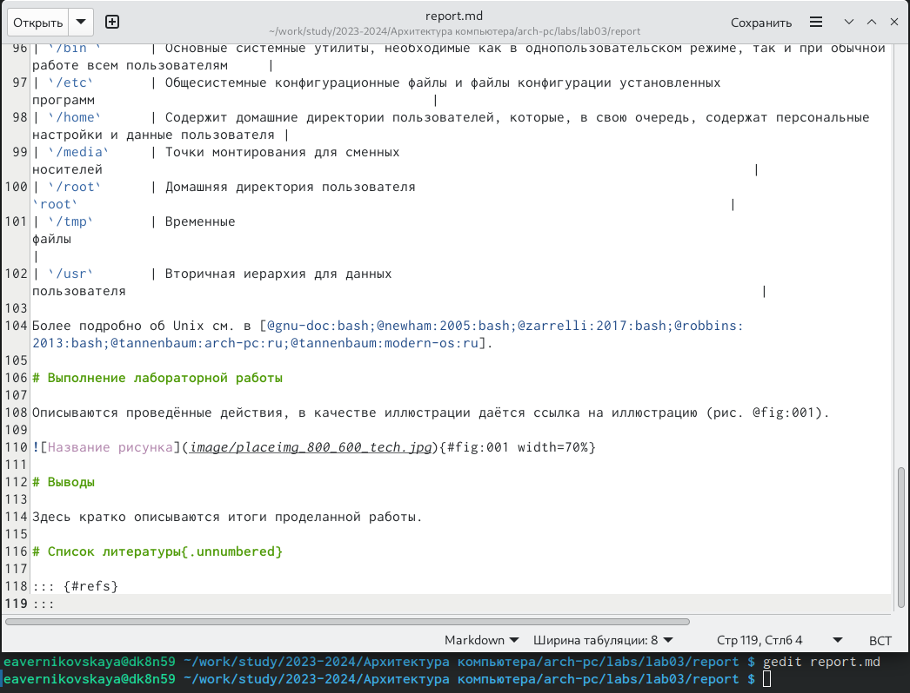
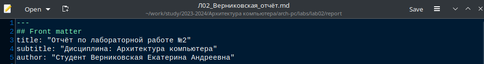

---
## Front matter
title: "Отчёт по лабораторной работе №3"
subtitle: "Дисциплина: Архитектура компьютера"
author: "Студент: Верниковская Екатерина Андреевна"

## Generic otions
lang: ru-RU
toc-title: "Содержание"

## Bibliography
bibliography: bib/cite.bib
csl: pandoc/csl/gost-r-7-0-5-2008-numeric.csl

## Pdf output format
toc: true # Table of contents
toc-depth: 2
lof: true # List of figures
lot: true # List of tables
fontsize: 12pt
linestretch: 1.5
papersize: a4
documentclass: scrreprt
## I18n polyglossia
polyglossia-lang:
  name: russian
  options:
	- spelling=modern
	- babelshorthands=true
polyglossia-otherlangs:
  name: english
## I18n babel
babel-lang: russian
babel-otherlangs: english
## Fonts
mainfont: PT Serif
romanfont: PT Serif
sansfont: PT Sans
monofont: PT Mono
mainfontoptions: Ligatures=TeX
romanfontoptions: Ligatures=TeX
sansfontoptions: Ligatures=TeX,Scale=MatchLowercase
monofontoptions: Scale=MatchLowercase,Scale=0.9
## Biblatex
biblatex: true
biblio-style: "gost-numeric"
biblatexoptions:
  - parentracker=true
  - backend=biber
  - hyperref=auto
  - language=auto
  - autolang=other*
  - citestyle=gost-numeric
## Pandoc-crossref LaTeX customization
figureTitle: "Рис."
tableTitle: "Таблица"
listingTitle: "Листинг"
lofTitle: "Список иллюстраций"
lotTitle: "Список таблиц"
lolTitle: "Листинги"
## Misc options
indent: true
header-includes:
  - \usepackage{indentfirst}
  - \usepackage{float} # keep figures where there are in the text
  - \floatplacement{figure}{H} # keep figures where there are in the text
---

# Цель работы

Освоить процедуры оформления отчётов с помощью легковесного языка разметки Markdown.

# Задание

1. Обновить локальный репозиторий, скачав изменения из удалённого репозитория.
2. Сделать отчёт по лабораторной работе №3 в формате Markdown. Предоставить отчёт в трёх форматах (pdf, docx, md).
3. Сделать отчёт по лабораторной работе №2 в формате Markdown. Предоставить отчёт в трёх форматах (pdf, docx, md).

# Выполнение лабораторной работы

## Освоение Markdown

С помощью команды ‘git pull’ обновляем локальный репозиторий (рис. [-@fig:001])

{ #fig:001 width=70% }

Переходим в каталог с шаблоном отчёта по лабораторной работе №3 и проводим компиляцию шаблона с использованием Makefile, используя команду ‘make’ (рис. [-@fig:002])

{ #fig:002 width=70% }

Проверяем файлы «report.pdf» и «report.docx», которые должны были сгенерироваться при успешной компиляции (рис. [-@fig:003]), (рис. [-@fig:004])

{ #fig:003 width=70% }

{ #fig:004 width=70% }

Удаляем полученные файлы с использованием Makefile. Для этого вводим команду ‘make clean’ (рис. [-@fig:005])

{ #fig:005 width=70% }

Проверяем, что файлы удалены (рис. [-@fig:006])

{ #fig:006 width=70% }

Открываем файл «report.md» с помощью текстового редактора gedit (рис. [-@fig:007])

{ #fig:007 width=70% }

Оформляем отчёт по лабораторной работе №3 в формате Markdown (рис. [-@fig:008]), (рис. [-@fig:009]), (рис. [-@fig:010])

{ #fig:008 width=70% }

{ #fig:009 width=70% }

{ #fig:010 width=70% }

Преобразовываем файл (отчёт по лабораторной рабоет №3) формата «.md» в формат «.pdf» и «.docx» с помощью команды ‘pandoc «.md» -o «.pdf»’ и ‘pandoc «.md» -o «.docx»’ (рис. [-@fig:011])

{ #fig:011 width=70% }

Проверяем проделанные действия (рис. [-@fig:012]), (рис. [-@fig:013]), (рис. [-@fig:014])

{ #fig:012 width=70% }

{ #fig:013 width=70% }

{ #fig:014 width=70% }

Загружаем файлы лабораторной работы №3 на github и проверяем (рис. [-@fig:015]), (рис. [-@fig:016]), (рис. [-@fig:017])

{ #fig:015 width=70% }

{ #fig:016 width=70% }

{ #fig:017 width=70% }
 
## Задание для самостоятельной работы

Переходим в каталог «labs/lab02/report» и с помощью текстового редактора gedit открываем файл «report.md» рис. [-@fig:018])

{ #fig:018 width=70% }

Оформляем отчёт по лабораторной работе №2 в формате Markdown (рис. [-@fig:019]), (рис. [-@fig:020]), (рис. [-@fig:021])

{ #fig:019 width=70% }

{ #fig:020 width=70% }

{ #fig:021 width=70% }

Преобразовываем файл (отчёт по лабораторной рабоет №2) формата «.md» в формат «.pdf» и «.docx» с помощью команды ‘pandoc «.md» -o «.pdf»’ и ‘pandoc «.md» -o «.docx»’ (рис. [-@fig:022])

{ #fig:022 width=70% }

Проверяем проделанные действия (рис. [-@fig:023]), (рис. [-@fig:024]), (рис. [-@fig:025])

{ #fig:023 width=70% }

{ #fig:024 width=70% }

{ #fig:025 width=70% }

Загружаем файлы лабораторной работы №2 на github и проверяем (рис. [-@fig:026]), (рис. [-@fig:027]), (рис. [-@fig:028])

{ #fig:026 width=70% }

{ #fig:027 width=70% }

{ #fig:028 width=70% }

# Выводы

В ходе лабораторной работы мы освоили процедуры оформления отчётов с помощью легковесного языка разметки Markdown.
