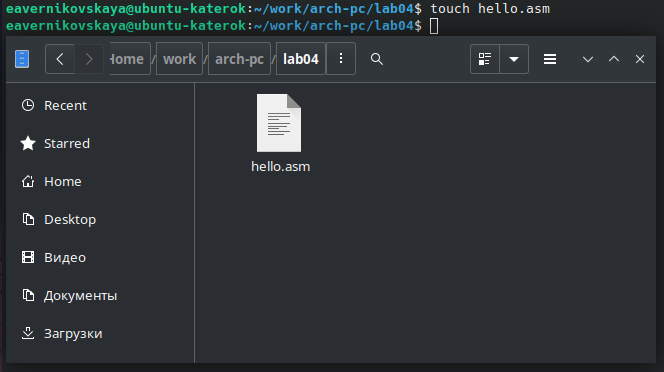

---
## Front matter
title: "Отчёт по лабораторной работе №4"
subtitle: "Дисциплина: Архитектура компьютера"
author: "Студент: Верниковская Екатерина Андреевна"

## Generic otions
lang: ru-RU
toc-title: "Содержание"

## Bibliography
bibliography: bib/cite.bib
csl: pandoc/csl/gost-r-7-0-5-2008-numeric.csl

## Pdf output format
toc: true # Table of contents
toc-depth: 2
lof: true # List of figures
lot: true # List of tables
fontsize: 12pt
linestretch: 1.5
papersize: a4
documentclass: scrreprt
## I18n polyglossia
polyglossia-lang:
  name: russian
  options:
	- spelling=modern
	- babelshorthands=true
polyglossia-otherlangs:
  name: english
## I18n babel
babel-lang: russian
babel-otherlangs: english
## Fonts
mainfont: PT Serif
romanfont: PT Serif
sansfont: PT Sans
monofont: PT Mono
mainfontoptions: Ligatures=TeX
romanfontoptions: Ligatures=TeX
sansfontoptions: Ligatures=TeX,Scale=MatchLowercase
monofontoptions: Scale=MatchLowercase,Scale=0.9
## Biblatex
biblatex: true
biblio-style: "gost-numeric"
biblatexoptions:
  - parentracker=true
  - backend=biber
  - hyperref=auto
  - language=auto
  - autolang=other*
  - citestyle=gost-numeric
## Pandoc-crossref LaTeX customization
figureTitle: "Рис."
tableTitle: "Таблица"
listingTitle: "Листинг"
lofTitle: "Список иллюстраций"
lotTitle: "Список таблиц"
lolTitle: "Листинги"
## Misc options
indent: true
header-includes:
  - \usepackage{indentfirst}
  - \usepackage{float} # keep figures where there are in the text
  - \floatplacement{figure}{H} # keep figures where there are in the text
---

# Цель работы

Освоить процедуры компиляции и сборки программ, написанных на ассемблере NASM. 

# Задание

1. Создать каталог для работы с программами на языке ассемблера NASM.
2. Создать текстовый файл с именем «hello.asm» и открыть этот файл с помощью текстового редактора.
3. Ввести в текстовый файл нужный текст.
4. Оттранслировать полученный текст программы «hello.asm» в объектный файл.
5. Выполнить компоновку объектного файла и запустить получившийся исполняемый файл.
6. Создать копию файла «hello.asm» с именем «lab4.asm» и проделать с ним те же действия, что и с файлом «hello.asm».
7. Скопировать файлы «hello.asm» и «lab4.asm» в локальный репозиторий в катклог «~/work/study/2023-2024/"Архитектура компьютера"/arch-pc/labs/lab04/».
8. Загрузить файлы на Github.

# Выполнение лабораторной работы

## Программа Hello world!

Создаём каталог для работы с программами на языке ассемблера NASM с помощью команды ‘mkdir -p’ (рис. [-@fig:001])

{#fig:001 width=70%}

Переходим в созданный каталог с помощью ‘cd’ (рис. [-@fig:002])

{#fig:002 width=70%}

Создаём текстовый файл с именем «hello.asm» (рис. [-@fig:003])

{#fig:003 width=70%}

Открываем файл с помошью текстового редактора «gedit» (рис. [-@fig:004])

{#fig:004 width=70%}

Вводим в открытый файл нужный текст (рис. [-@fig:005])

{#fig:005 width=70%}

## Транслятор NASM

С помощью ‘nasm -f elf’ транслируем текст программы в объектный файл и проверяем с помощью ‘ls’ (рис. [-@fig:006])

{#fig:006 width=70%}

## Расширенный синтаксис командной строки NASM

Компилируем исходный файл «hello.asm» в «obj.o» с помощью ‘nasm -o’ и ‘-f elf -g -l’ и проверяем с помощью ‘ls’ (рис. [-@fig:007])

{#fig:007 width=70%}

## Компоновщик LD

Передаём объектный файл «hello.o» на обработку компоновщику с помощью ‘ld -m elf_i386 ... -o’и проверяем с помощью ‘ls’ (рис. [-@fig:008])

{#fig:008 width=70%}

Выполняем следующую команду ‘ld -m elf_i386 obj.o -o main’ (рис. [-@fig:009])

{#fig:009 width=70%}

Ответ на вопрос:
1) Исполняемый файл будет иметь имя «main»
2) Объектный файл из которого собран этот исполняемый называется «obj.o»

## Запуск исполняемого файла

С помощью ‘./hello’ запускаем исполняемый файл (рис. [-@fig:010])

{#fig:010 width=70%}

## Задание для самостоятельной работы

С помощью ‘cp’ создаём копию файла «hello.asm» с именем «lab4.asm» и проверяем с помощью ‘ls’ (рис. [-@fig:011])

{#fig:011 width=70%}

С помощью текстового редактора «gedit» открываем файл «lab4.asm» (рис. [-@fig:012])

{#fig:012 width=70%}

Вносим изменение в текстовый файл так, чтобы на экран выводилась строка с нашим именем и фамилией (рис. [-@fig:013])

{#fig:013 width=70%}

С помощью ‘nasm -f elf’ транслируем текст программы в объектный файл и проверяем с помощью ‘ls’ (рис. [-@fig:014]), (рис. [-@fig:015])

{#fig:014 width=70%}

{#fig:015 width=70%}

Компилируем исходный файл «lab4.asm» в «obj4.o» с помощью ‘nasm -o’ и ‘-f elf -g -l’ и проверяем с помощью ‘ls’ (рис. [-@fig:016])

{#fig:016 width=70%}

Передаём объектный файл «lab4.o» на обработку компоновщику с помощью ‘ld -m elf_i386 ... -o’и проверяем с помощью ‘ls’ (рис. [-@fig:017])

{#fig:017 width=70%}

Передаём объектный файл «obj4.o» на обработку компоновщику с помощью ‘ld -m elf_i386 ... -o’и проверяем с помощью ‘ls’ (рис. [-@fig:018])

{#fig:018 width=70%}

С помощью ‘./lab4’ запускаем исполняемый файл (рис. [-@fig:019])

{#fig:019 width=70%}

С помощью ‘cp’ копируем файлы «hello.asm» и «lab4.asm» в локальный репозиторий в катклог «~/work/study/2023-2024/"Архитектура компьютера"/arch-pc/labs/lab04/» (рис. [-@fig:020])

{#fig:020 width=70%}

Проверяем с помощью ‘ls’ (рис. [-@fig:021]), (рис. [-@fig:022])

{#fig:021 width=70%}

{#fig:022 width=70%}

Загружаем файлы на github (рис. [-@fig:023])

{#fig:023 width=70%}

Проверяем. Всё хорошо! (рис. [-@fig:024])

{#fig:024 width=70%}

# Выводы

В ходе выполнения лабораторной работы мы освоили процедуры компиляции и сборки программ, написанных на ассемблере NASM.
