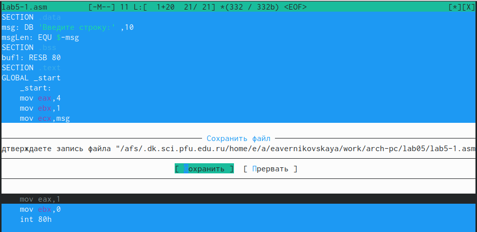
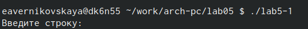
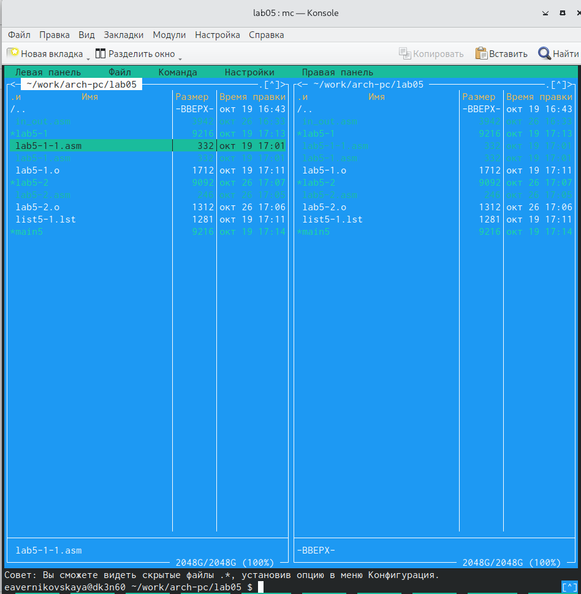

---
## Front matter
title: "Отчёт по лабораторной работе №5"
subtitle: "Дисциплина: Архитектура компьютера"
author: "Студент: Верниковская Екатерина Андреевна"

## Generic otions
lang: ru-RU
toc-title: "Содержание"

## Bibliography
bibliography: bib/cite.bib
csl: pandoc/csl/gost-r-7-0-5-2008-numeric.csl

## Pdf output format
toc: true # Table of contents
toc-depth: 2
lof: true # List of figures
lot: true # List of tables
fontsize: 12pt
linestretch: 1.5
papersize: a4
documentclass: scrreprt
## I18n polyglossia
polyglossia-lang:
  name: russian
  options:
	- spelling=modern
	- babelshorthands=true
polyglossia-otherlangs:
  name: english
## I18n babel
babel-lang: russian
babel-otherlangs: english
## Fonts
mainfont: PT Serif
romanfont: PT Serif
sansfont: PT Sans
monofont: PT Mono
mainfontoptions: Ligatures=TeX
romanfontoptions: Ligatures=TeX
sansfontoptions: Ligatures=TeX,Scale=MatchLowercase
monofontoptions: Scale=MatchLowercase,Scale=0.9
## Biblatex
biblatex: true
biblio-style: "gost-numeric"
biblatexoptions:
  - parentracker=true
  - backend=biber
  - hyperref=auto
  - language=auto
  - autolang=other*
  - citestyle=gost-numeric
## Pandoc-crossref LaTeX customization
figureTitle: "Рис."
tableTitle: "Таблица"
listingTitle: "Листинг"
lofTitle: "Список иллюстраций"
lotTitle: "Список таблиц"
lolTitle: "Листинги"
## Misc options
indent: true
header-includes:
  - \usepackage{indentfirst}
  - \usepackage{float} # keep figures where there are in the text
  - \floatplacement{figure}{H} # keep figures where there are in the text
---

# Цель работы

Приобрести практические навыки работы в Midnight Commander и освоить инструкции языка ассемблера mov и int.

# Задание

1. Открыть Midnight Commander.
2. Создать папку lab05, где будут храниться файлы лабортаорной работы №5.
3. Создать файл «lab5-1.asm», ввести текст программы. Оттранслировать текст программы, выполнить компоновку объектного файла и запустить получившийся исполняемый файл.
4. Скачать с ТУИС файл «in_out.asm» и переместить его в каталог lab05.
5. Скопировать файл «lab5-1.asm» с именем «lab5-2.asm» и исправить текст программы так чтобы использовались программы из внешнего файла «in_out.asm».
6. Создать исполняемый файл и проверить его работу.
7. Создать копию файла «lab5-1.asm». Внести измененя в программу (без использования внешнего файла «in_out.asm»), так чтобы она работа по определённуму алгоритму.
8. Создать копию файла «lab5-2.asm». Также исправить текст программы, но уже с использованием подпрограмм из внешнего файла «in_out.asm», так чтобы она работала по определённуму алгоритму.
9. Создать исполняемые файлы и проверить их работу.

# Выполнение лабораторной работы

## Изучение Midnight Commander

Открываем Midnight Commander с помощью команды ‘mc’ (рис. [-@fig:001]), (рис. [-@fig:002])

{#fig:001 width=70%}

{#fig:002 width=70%}

Пользуясь клавишами на клавиатуре ‘вверх’, ‘вниз’ и ‘enter’ переходим в каталог «~/work/arch-pc» (рис. [-@fig:003])

{#fig:003 width=70%}

С помощью функциональной клавиши ‘F7’ создаём папку «lab05» и переходим в неё рис. [-@fig:004]), (рис. [-@fig:005]), рис. [-@fig:006])

{#fig:004 width=70%}

{#fig:005 width=70%}

{#fig:006 width=70%}

Пользуясь строкой ввода и командой ‘touch’ создаём файл «lab5-1.asm» рис. [-@fig:007]), (рис. [-@fig:008])

{#fig:007 width=70%}

{#fig:008 width=70%}

С помощью функциональной клавиши ‘F4’ открываем файл «lab5-1.asm» для редактирования во встроенном редакторе. В нашем случае это mcedit (рис. [-@fig:009])

{#fig:009 width=70%}

Вводим текст программы (рис. [-@fig:010])

Текст программы:

```NASM
SECTION .data 
msg: DB 'Введите строку:',10 
msgLen: EQU $-msg 
SECTION .bss 
buf1: RESB 80
SECTION .text 
GLOBAL _start 
	_start:
	mov eax,4 
	mov ebx,1 
	mov ecx,msg 
	mov edx,msgLen 
	int 80h
	mov eax, 3 
	mov ebx, 0 
	mov ecx, buf1 
	mov edx, 80
	int 80h
	mov eax,1 
	mov ebx,0 
	int 80h 
```

{#fig:010 width=70%}

С помощью функциональной клавиши ‘F2’ сохраняем изменения и выходим с помощью ‘F10’ (рис. [-@fig:011])

{#fig:011 width=70%}

С помощью функциональной клавиши ‘F3’ открываем изменённый файл, чтобы убедиться, что он содержит текст программы (рис. [-@fig:012])

{#fig:012 width=70%}

Транслируем текст программы в объектрный файл, компилируем исходный файл, передаём объектный файл на обработку компоновщику (рис. [-@fig:013]), (рис. [-@fig:014]), (рис. [-@fig:015]), (рис. [-@fig:016]), (рис. [-@fig:017]), (рис. [-@fig:018]), (рис. [-@fig:019]), (рис. [-@fig:020])

{#fig:013 width=70%}

{#fig:014 width=70%}

{#fig:015 width=70%}

{#fig:016 width=70%}

{#fig:017 width=70%}

{#fig:018 width=70%}

{#fig:019 width=70%}

{#fig:020 width=70%}

Запускаем получившийся исполняемый файл (рис. [-@fig:021])

{#fig:021 width=70%}

На запрос вводим наше ФИО (рис. [-@fig:022])

{#fig:022 width=70%}

## Подключение внешнего файла in_out.asm 

Скачиваем файл «in_out.asm» с ТУИС (рис. [-@fig:023])

{#fig:023 width=70%}

В одной из панелей mc открываем каталог с файлом «lab5-1.asm», в другой - каталог со скачанным файлом «in_out.asm» (рис. [-@fig:024])

{#fig:024 width=70%}

С помощью функциональной клавиши ‘F5’ копируем файл «in_out.asm» в каталог с файлом «lab5-1.asm» (рис. [-@fig:025]), (рис. [-@fig:026])

{#fig:025 width=70%}

{#fig:026 width=70%}

С помощью той же функциональной клавиши ‘F5’ создаём копию файла «lab5-1.asm» с именем «lab5-2.asm» (рис. [-@fig:027]), (рис. [-@fig:028])

{#fig:027 width=70%}

{#fig:028 width=70%}

С помощью функцональной клавиши ‘F4’ открываем файл «lab5-2.asm» для редактирования и исправляем текст программы с использованием подпрограмм из внешнего файла «in_out.asm» (рис. [-@fig:029])

Текст программы:

```NASM
%include 'in_out.asm'
SECTION .data 
msg: DB 'Введите строку:',10 
SECTION .bss 
buf1: RESB 80
SECTION .text 
GLOBAL _start 
	_start:
	mov eax, msg 
	call sprintLF
	mov ecx, buf1
	mov edx, 80
	call sread
	call quit 
```

{#fig:029 width=70%}

Транслируем текст программы в объектный файл, выполняем компоновку объектного файла и запускаем получившийся исполняемый файл (рис. [-@fig:030]), (рис. [-@fig:031]), (рис. [-@fig:032]), (рис. [-@fig:033])

{#fig:030 width=70%}

{#fig:031 width=70%}

{#fig:032 width=70%}

{#fig:033 width=70%}

В файле «lab5-2.asm» заменяем подпрограмму ‘sprintLF’ на ‘sprint’ (рис. [-@fig:034])

Текст исправленной программы:

```NASM
%include 'in_out.asm'
SECTION .data 
msg: DB 'Введите строку:',10 
SECTION .bss 
buf1: RESB 80
SECTION .text 
GLOBAL _start 
	_start:
	mov eax, msg 
	call sprint
	mov ecx, buf1
	mov edx, 80
	call sread
	call quit 
```

{#fig:034 width=70%}

Создаём исполняемый файл и проверяем его работу (рис. [-@fig:035])

{#fig:035 width=70%}

Ответ на вопрос: в первом случае программа просила нас ввести текст на следующей строке, во втором - сразу после знака двоеточия. 

## Задание для самостоятельной работы

Создаём копию файла «lab5-1.asm» с именем «lab5-1-1.asm» (рис. [-@fig:036]), (рис. [-@fig:037])

{#fig:036 width=70%}

{#fig:037 width=70%}

Вносим изменения в программу (без использования внешнего файла «in_out.asm»), так чтобы она работала по следующему алгоритму:

- Вывести приглашение типа "Введите строку:";
- Ввести строку с клавиатуры;
- Вывести введённую строку на экран; (рис. [-@fig:038])

Текст программы:

```NASM
SECTION .data 
msg: DB 'Введите строку:',10
msgLen: EQU $-msg 
SECTION .bss 
buf1: RESB 80
SECTION .text 
GLOBAL _start 
	_start:
	mov eax,4
	mov ebx,1
	mov ecx,msg
	mov edx,msgLen
	int 80h
	mov eax, 3
	mov ebx, 0
	mov ecx, buf1
	mov edx, 80
	int 80h
	mov eax,1
	mov ebx,0
	int 80h
```

{#fig:038 width=70%}

Получаем исполняемый файл и проверяем его работу. На приглашение вводим свою фамилию и имя (рис. [-@fig:039])

{#fig:039 width=70%}

Создаём копию файла «lab5-2.asm» с именем «lab5-2-2.asm» (рис. [-@fig:040]), (рис. [-@fig:041])

{#fig:040 width=70%}

{#fig:041 width=70%}

Вносим изменения в программу (уже с использованием подпрограмм из внешнего файла «in_out.asm»), так чтобы она работала по следующему алгоритму:

- Вывести приглашение типа "Введите строку:";
- Ввести строку с клавиатуры;
- Вывести введённую строку на экран; (рис. [-@fig:042])

Текст программы:

```NASM
%include 'in_out.asm' 
SECTION .data 
msg: DB 'Введите строку:',10
SECTION .bss 
buf1: RESB 80
SECTION .text 
GLOBAL _start 
	_start:
	mov eax, msg
	call sprint
	mov ecx, buf1
	mov edx, 80
	call sread
	mov eax,4
	mov ebx,1
	mov ecx,buf1
	int 80h
	call quit
```

{#fig:042 width=70%}

Создаём исполняемый файл и проверяем его работу (рис. [-@fig:043])

{#fig:043 width=70%}

# Выводы

В ходе выполнения лабораторной работы мы приобрели навыки работы в Midnight Commander, а так же освоили инструкции языка ассемблера mov и int.

