---
## Front matter
title: "Отчёт по лабораторной работе №6"
subtitle: "Дисциплина: Архитектура компьютера"
author: "Студент: Верниковская Екатерина Андреевна"

## Generic otions
lang: ru-RU
toc-title: "Содержание"

## Bibliography
bibliography: bib/cite.bib
csl: pandoc/csl/gost-r-7-0-5-2008-numeric.csl

## Pdf output format
toc: true # Table of contents
toc-depth: 2
lof: true # List of figures
lot: true # List of tables
fontsize: 12pt
linestretch: 1.5
papersize: a4
documentclass: scrreprt
## I18n polyglossia
polyglossia-lang:
  name: russian
  options:
	- spelling=modern
	- babelshorthands=true
polyglossia-otherlangs:
  name: english
## I18n babel
babel-lang: russian
babel-otherlangs: english
## Fonts
mainfont: PT Serif
romanfont: PT Serif
sansfont: PT Sans
monofont: PT Mono
mainfontoptions: Ligatures=TeX
romanfontoptions: Ligatures=TeX
sansfontoptions: Ligatures=TeX,Scale=MatchLowercase
monofontoptions: Scale=MatchLowercase,Scale=0.9
## Biblatex
biblatex: true
biblio-style: "gost-numeric"
biblatexoptions:
  - parentracker=true
  - backend=biber
  - hyperref=auto
  - language=auto
  - autolang=other*
  - citestyle=gost-numeric
## Pandoc-crossref LaTeX customization
figureTitle: "Рис."
tableTitle: "Таблица"
listingTitle: "Листинг"
lofTitle: "Список иллюстраций"
lotTitle: "Список таблиц"
lolTitle: "Листинги"
## Misc options
indent: true
header-includes:
  - \usepackage{indentfirst}
  - \usepackage{float} # keep figures where there are in the text
  - \floatplacement{figure}{H} # keep figures where there are in the text
---

# Цель работы

Освоить арифмитические инструкции языка ассемблера NASM.

# Задание

1. Создать каталог для программ лабораторной работы №6 и в нём создать файл «lab6-1.asm».
2. Ввести в файл «lab6-1.asm» определённый текст программы. Создать исполняемый файл и запустить его.
3. Изменить текст программы. Снова создать исполняемый файл и запустить его.
4. Создать файл «lab6-2.asm» и файл «lab6-3.asm». С этими файлами проделать такие же действия как и с файлом «lab6-1.asm».
5. Создать файл «variant.asm». Написать программу, которая вычисляет вариант задания по номеру студенческого билета.
6. Написать программу вычисления выражения y = f(x). Программа должна выводить выражение для вычисления, выводить запрос на ввод значения x, вычислять заданное выражение в зависимости от введенного x, выводить результат вычислений. Вид функции f(x) выбрать из нужной таблицы вариантов заданий в соответствии с номером полученным при выполнении лабораторной работы. 
7. Создать исполняемый файл и проверить его работы для значений x1 и x2 из нужной таблицы.

# Выполнение лабораторной работы

## Символьные и численные данные в NASM

В созданном каталоге «~/work/arch-pc/lab06» создаём файл «lab6-1.asm» (рис. [-@fig:001])

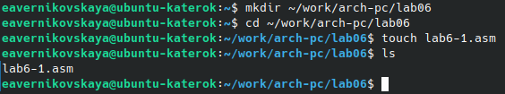{#fig:001 width=70%}

Копируем из каталога «~/work/arch-pc/lab05» файл «in_out.asm» (рис. [-@fig:002])

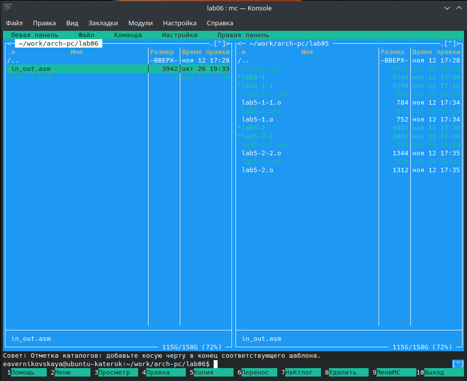{#fig:002 width=70%}

Вводим нужный текст программы (рис. [-@fig:003])

Текст программы:

```NASM
%include 'in_out.asm' 
SECTION .bss 
buf1: RESB 80
SECTION .text 
GLOBAL _start 
_start:
	mov eax,'6' 
	mov ebx,'4'
	add eax,ebx 
	mov [buf1],eax 
	mov eax,buf1
	call sprintLF
	call quit 
```

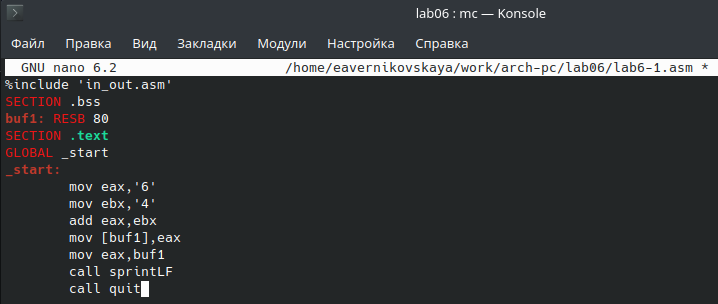{#fig:003 width=70%}

Создаём исполняемый файл и запускаем его (рис. [-@fig:004])

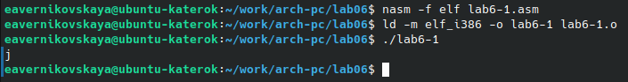{#fig:004 width=70%}

Изменяем текст программы и вместо символов, записываем числа (рис. [-@fig:005])

Изменённый текст программы:

```NASM
%include 'in_out.asm' 
SECTION .bss 
buf1: RESB 80
SECTION .text 
GLOBAL _start 
_start:
	mov eax,6 
	mov ebx,4
	add eax,ebx 
	mov [buf1],eax 
	mov eax,buf1
	call sprintLF
	call quit 
```

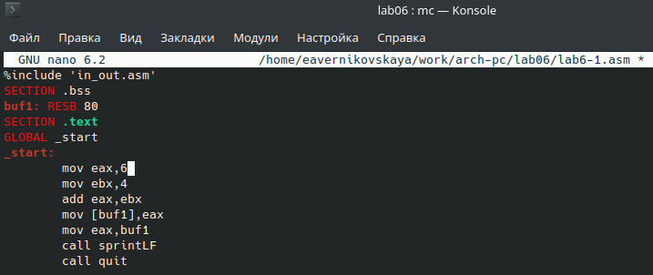{#fig:005 width=70%}

Снова создаём исполняемый файл и запускаем его (рис. [-@fig:006])

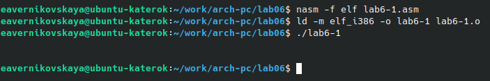{#fig:006 width=70%}

В данном случае выводится символ с кодом 10. Пользуясь таблицей ASCII определяем какому символу соответствуед код 10. Это символ перевода строки LF (Line Feed), который отображается при выводе на экран.

Создаём файл «lab6-2.asm» (рис. [-@fig:007])

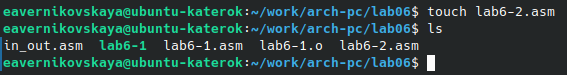{#fig:007 width=70%}

Вводим текст программы (рис. [-@fig:008])

Текст программы:

```NASM
%include 'in_out.asm'
SECTION .text 
GLOBAL _start 
_start:
	mov eax,'6' 
	mov ebx,'4'
	add eax,ebx 
	call iprintLF
	call quit 
```

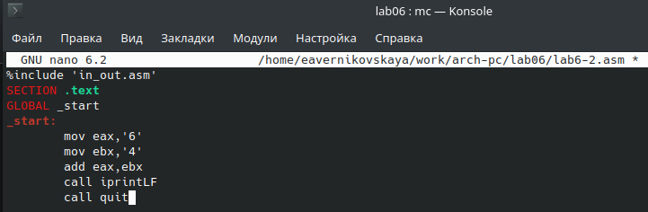{#fig:008 width=70%}

Создаём исполняемый файл и запускаем его (рис. [-@fig:009])

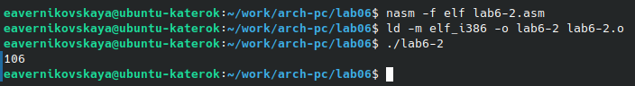{#fig:009 width=70%}

Аналогично предыдущему примеру меняем символы на числа рис. [-@fig:010])

Изменённый текст программы:

```NASM
%include 'in_out.asm'
SECTION .text 
GLOBAL _start 
_start:
	mov eax,6 
	mov ebx,4
	add eax,ebx 
	call iprintLF
	call quit 
```

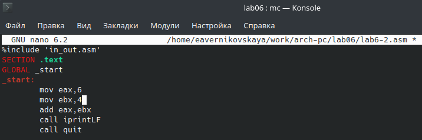{#fig:010 width=70%}

Опять создаём исполняемый файл и запускаем его (рис. [-@fig:011])

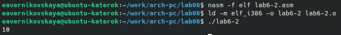{#fig:011 width=70%}

При исполнении программы будет получен нужный результат - *10*.

Меняем функцию iprintLF на iprint (рис. [-@fig:012])

Изменённый текст программы:

```NASM
%include 'in_out.asm'
SECTION .text 
GLOBAL _start 
_start:
	mov eax,6 
	mov ebx,4
	add eax,ebx 
	call iprint
	call quit 
```

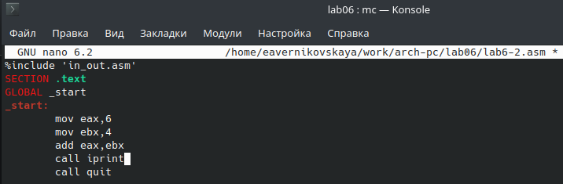{#fig:012 width=70%}

Опять создаём исполняемый файл и запускаем его (рис. [-@fig:013])

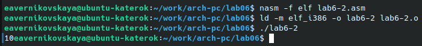{#fig:013 width=70%}

Функция iprintLF выводит строку с добавлением символа LF (перевода строки), а функция iprint просто выводит строку без добавления этого символа (вывод будет продолжатся на той же строке).

Создаём файл «lab6-3.asm» (рис. [-@fig:014])

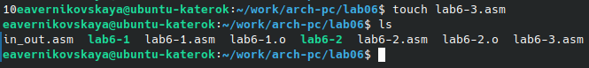{#fig:014 width=70%}

Вводим текст программы для вычисления выражения *f(x) = (5 x 2 + 3)/3* (рис. [-@fig:015])

Текст программы:

```NASM
%include 'in_out.asm'
SECTION .data
div: DB 'Результат: ',0
rem: DB 'Остаток от деления: ',0
SECTION .text 
GLOBAL _start 
_start:
	mov eax,5
	mov ebx,2
	mul ebx
	add eax,3
	xor edx,edx
	mov ebx,3
	div ebx
	mov edi,eax
	mov eax,div
	call sprint
	mov eax,edi
	call iprintLF
	mov eax,rem
	call sprint
	mov eax,edx
	call iprintLF
	call quit
```

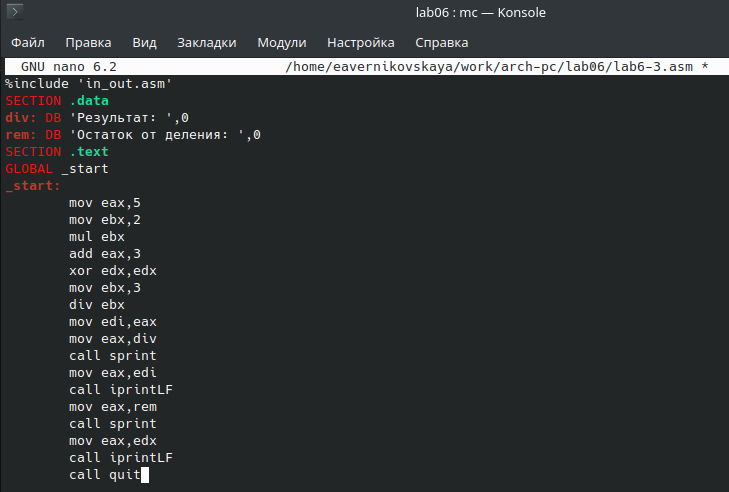{#fig:015 width=70%}

Создаём исполняемый файл и запускаем его (рис. [-@fig:016])

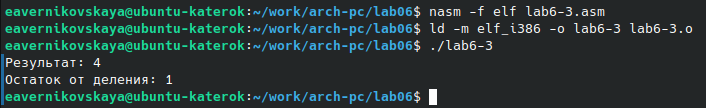{#fig:016 width=70%}

Изменяем текст программы для вычисления выражения *f(x) = (4 x 6 + 2)/5* (рис. [-@fig:017])

Изменённый текст программы:

```NASM
%include 'in_out.asm'
SECTION .data
div: DB 'Результат: ',0
rem: DB 'Остаток от деления: ',0
SECTION .text 
GLOBAL _start 
_start:
	mov eax,4
	mov ebx,6
	mul ebx
	add eax,2
	xor edx,edx
	mov ebx,5
	div ebx
	mov edi,eax
	mov eax,div
	call sprint
	mov eax,edi
	call iprintLF
	mov eax,rem
	call sprint
	mov eax,edx
	call iprintLF
	call quit
```

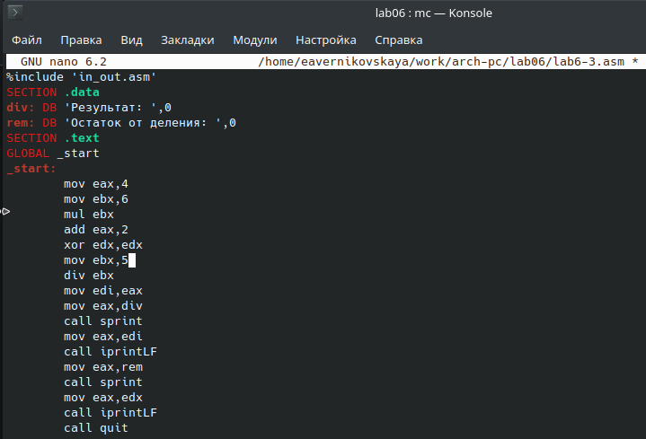{#fig:017 width=70%}

Снова создаём исполняемый файл и запускаем его (рис. [-@fig:018])

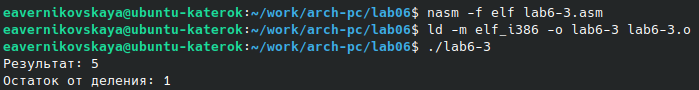{#fig:018 width=70%}

Создаём файл «variant.asm» (рис. [-@fig:019])

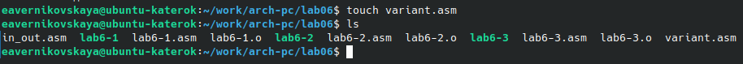{#fig:019 width=70%}

Вводим текст программы вычисления варианта задания по номер студенческого билета, которая будет работать по следующему алгоритму:

- вывести запрос на введение No студенческого билета;
- вычислить номер варианта по формуле: (Sn mod 20) + 1, где Sn – номер студенческого билета (В данном случае a mod b – это остаток от деления a на b);
- вывести на экран номер варианта; (рис. [-@fig:020])

Текст программы:

```NASM
%include 'in_out.asm'
SECTION .data
msg: DB 'Введите № студенческого билета: ',0
rem: DB 'Ваш вариант: ',0
SECTION .bss
x: RESB 80
SECTION .text 
GLOBAL _start 
_start:
	mov eax,msg
	call sprintLF
	mov ecx,x
	mov edx,80
	call sread
	mov eax,x
	call atoi
	xor edx,edx
	mov ebx,20
	div ebx
	inc edx
	mov eax,rem
	call sprint
	mov eax,edx
	call iprintLF
	call quit
```

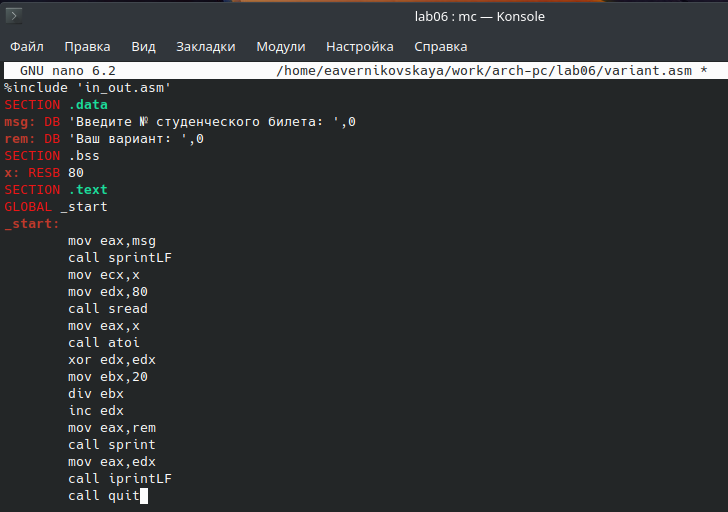{#fig:020 width=70%}

Cоздаём исполняемый файл и запускаем его (рис. [-@fig:021])

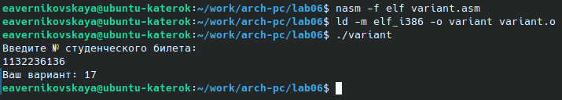{#fig:021 width=70%}

ОТВЕТЫ НА ВОПРОСЫ:

1. Какие строки листинга 6.4 отвечают за вывод на экран сообщения ‘Ваш вариант:’?

```NASM
mov eax,rem
call sprint
```
2. Для чего используется следующие инструкции? “mov ecx,x“, “mov edx,80“, “call sread“

“mov ecx,x“ - запись адреса пересенной в ecx
“mov edx,80“ -  запись длины вводимого значения в edx
“call sread“ - вызов подпрограммы ввода сообщения

3. Для чего используется инструкция “call atoi”?

Вызывает функцию, которая преобразует ascii-код символа в целое числои записывает результат в регистр eax. Перед вызовом atoi в регистр eax нужно записать число.

4. Какие строки листинга 6.4 отвечают за вычисления варианта?

```NASM
mov eax,x
call atoi
xor edx,edx
mov ebx,20
div ebx
inc edx
```

5. В какой регистр записывается остаток от деления при выполнении инструкции “div ebx”?

При выполнении этой инструкции остаток от деления будет записываться в регистр AH.

6. Для чего используется инструкция “inc edx”?

Увеличивает значение регистра edx на 1.

7. Какие строки листинга 6.4 отвечают за вывод на экран результата вычислений?

```NASM
mov eax,edx
call iprintLF
```

## Задание для самостоятельной работы

Создаём файл «lab6-4.asm» (рис. [-@fig:022])

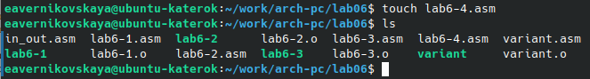{#fig:022 width=70%}

Вводим текст программы для вычисления выражения *y = f(x)*. В предыдщуем задании мы получили № нашего варианта - 17. Значит пишем программу вычисления выражения *y = 18(x + 1)/6* (рис. [-@fig:023])

```NASM
%include 'in_out.asm'
SECTION .data
fx: DB 'y=18(x + 1)/6',0
msg: DB 'Введите x: ',0
rez: DB 'Ответ: ',0
SECTION .bss
x: RESB 80
SECTION .text 
GLOBAL _start 
_start:
	mov eax,fx
	call sprintLF
	mov eax,msg
	call sprint
	mov ecx,x
	mov edx,80
	call sread
	mov eax,x
	call atoi
	add eax,1
	mov ebx,18
	mul ebx
	mov ecx,6
	div ecx
	mov edi,eax
	mov eax,rez
	call sprint
	mov eax,edi
	call iprintLF
	call quit
```

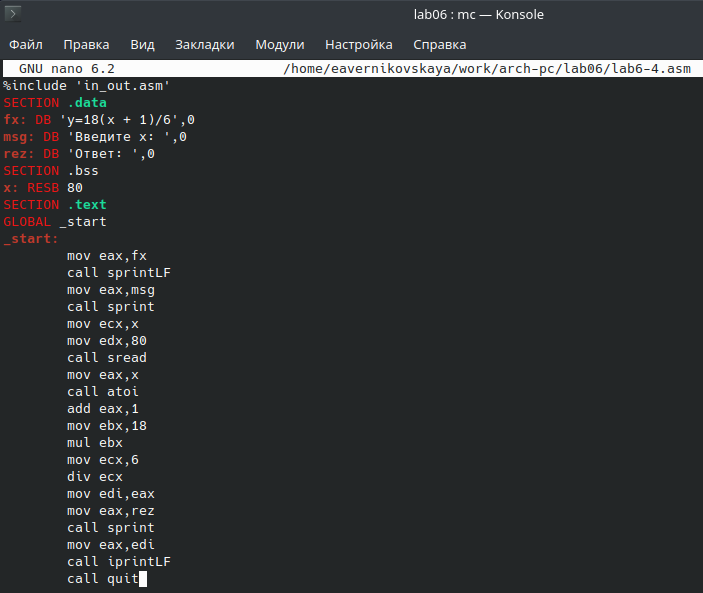{#fig:023 width=70%}

Cоздаём исполняемый файл и запускаем его. Проверяем работу программы при введённых значениях x1 = 3 и x2 = 1 (рис. [-@fig:024])

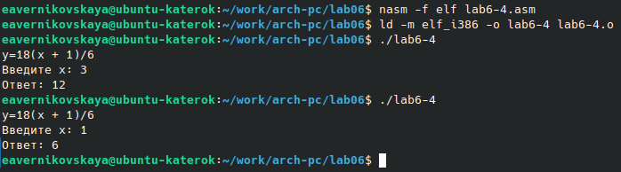{#fig:024 width=70%}

# Выводы

В ходе выполнения лабораторногй работы мы освоили арифмитические инструкции языка ассемблера NASM.
