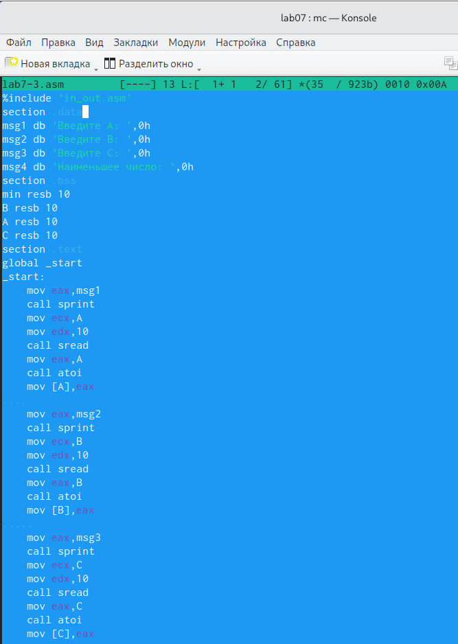
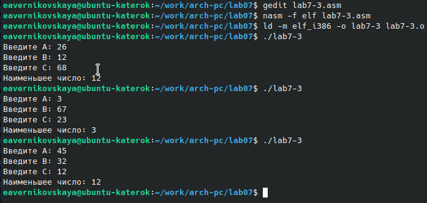

---
## Front matter
title: "Отчёт по лабораторной работе №7"
subtitle: "Дисциплина: Архитектура компьютера"
author: "Студент: Верниковская Екатерина Андреевна"

## Generic otions
lang: ru-RU
toc-title: "Содержание"

## Bibliography
bibliography: bib/cite.bib
csl: pandoc/csl/gost-r-7-0-5-2008-numeric.csl

## Pdf output format
toc: true # Table of contents
toc-depth: 2
lof: true # List of figures
lot: true # List of tables
fontsize: 12pt
linestretch: 1.5
papersize: a4
documentclass: scrreprt
## I18n polyglossia
polyglossia-lang:
  name: russian
  options:
	- spelling=modern
	- babelshorthands=true
polyglossia-otherlangs:
  name: english
## I18n babel
babel-lang: russian
babel-otherlangs: english
## Fonts
mainfont: PT Serif
romanfont: PT Serif
sansfont: PT Sans
monofont: PT Mono
mainfontoptions: Ligatures=TeX
romanfontoptions: Ligatures=TeX
sansfontoptions: Ligatures=TeX,Scale=MatchLowercase
monofontoptions: Scale=MatchLowercase,Scale=0.9
## Biblatex
biblatex: true
biblio-style: "gost-numeric"
biblatexoptions:
  - parentracker=true
  - backend=biber
  - hyperref=auto
  - language=auto
  - autolang=other*
  - citestyle=gost-numeric
## Pandoc-crossref LaTeX customization
figureTitle: "Рис."
tableTitle: "Таблица"
listingTitle: "Листинг"
lofTitle: "Список иллюстраций"
lotTitle: "Список таблиц"
lolTitle: "Листинги"
## Misc options
indent: true
header-includes:
  - \usepackage{indentfirst}
  - \usepackage{float} # keep figures where there are in the text
  - \floatplacement{figure}{H} # keep figures where there are in the text
---

# Цель работы

Изучить команды условного и безусловного переходов. Приобрести навыки написания программ с использованием переходов. Ознакомиться с назначением и структурой файла листинга.

# Задание

1. Создать каталог для программ лабораторной работы №7 и в нём создать файл «lab7-1.asm».
2. Ввести в файл «lab7-1.asm» определённый текст программы с использованием инструкции jmp. Создать исполняемый файл и запустить его.
3. Изменить текст программы. Снова создать исполняемый файл и запустить его.
4. Опять изменить текст программы, чтобы строки выводились в нужном порядке, создать исполняемый файл и запустить его.
5. Создать файл «lab7-2.asm» и ввести в него определённый текст. Создать исполняемый файл и запустить его.
5. Создать файл листинга для программы из файла «lab7-2.asm». Открыть его с помощью любого текстового редактора. Подробно объяснитьсодержимое трёх строк файла истинга по выбору.
6. Открыть файл «lab7-2.asm» и в любой интсрукции  двумя операндами удалить один операнд. Ответить на поставленные вопрсы. 
7. Напишите программу, которая находит из 3 целочисленных переменных наименьшее. Значения переменных брять из нужной таблицы в соответствии с вариантом, полученным при выполнении лабораторной работы №6 (У меня 17 вариант).
8. Написать программу, которая для введённых значений x и a вычисляет значение заданной функции F(x). Вид функции и значения брать из определённой таблицы, в соответствии с полученным вариантом (В нашем случае это 17 вариант). 

# Выполнение лабораторной работы

## Реализация переходов в NASM

В созданном каталоге «~/work/arch-pc/lab07» создаём файл «lab7-1.asm» (рис. [-@fig:001])

{#fig:001 width=70%}

Копируем из каталога «~/work/arch-pc/lab06» файл «in_out.asm» (рис. [-@fig:002])

{#fig:002 width=70%}

Вводим нужный текст программы с использованием инструкции jmp (рис. [-@fig:003])

Текст программы:

```NASM
%include 'in_out.asm' 
SECTION .data
msg1: DB 'Сообщение № 1',0
msg2: DB 'Сообщение № 2',0
msg3: DB 'Сообщение № 3',0
SECTION .text 
GLOBAL _start 
_start:
	jmp _label2
	_label1:
		mov eax,msg1
		call sprintLF 
	_label2:
		mov eax,msg2
		call sprintLF
	_label3:
		mov eax,msg3
		call sprintLF
	_end:
		call quit 
```

{#fig:003 width=70%}

Создаём исполняемый файл и запускаем его (рис. [-@fig:004])

{#fig:004 width=70%}

Изменяем текст программы так, чтобы она выводила сначала 'Сообщение № 2' а потом 'Сообщение № 1' и завершала работу (рис. [-@fig:005])

Изменённый текст программы:

```NASM
%include 'in_out.asm' 
SECTION .data
msg1: DB 'Сообщение № 1',0
msg2: DB 'Сообщение № 2',0
msg3: DB 'Сообщение № 3',0
SECTION .text 
GLOBAL _start 
_start:
	jmp _label2
	_label1:
		mov eax,msg1
		call sprintLF
		jmp _end
	_label2:
		mov eax,msg2
		call sprintLF
		jmp _label1
	_label3:
		mov eax,msg3
		call sprintLF
	_end:
		call quit 
```

{#fig:005 width=70%}

Снова создаём исполняемый файл и запускаем его (рис. [-@fig:006])

{#fig:006 width=70%}

Изменяем текст программы так, чтобы  она выводила сообщения в обратном порядке, т.е. сначала 3, потом 2, потом 1 и завершала работу (рис. [-@fig:007])

Изменённый текст программы: 

```NASM
%include 'in_out.asm' 
SECTION .data
msg1: DB 'Сообщение № 1',0
msg2: DB 'Сообщение № 2',0
msg3: DB 'Сообщение № 3',0
SECTION .text 
GLOBAL _start 
_start:
	jmp _label3
	_label1:
		mov eax,msg1
		call sprintLF
		jmp _end
	_label2:
		mov eax,msg2
		call sprintLF
		jmp _label1
	_label3:
		mov eax,msg3
		call sprintLF
		jmp _label2
	_end:
		call quit 
```

{#fig:007 width=70%}

Опять создаём исполняемый файл и запускаем его (рис. [-@fig:008])

{#fig:008 width=70%}

Создаём файл «lab7-2.asm» (рис. [-@fig:009])

{#fig:009 width=70%}

Вводим текст программы, которая определяет и выводит на экран наибольшее число из 3 целочисленных переменных A, B, C (рис. [-@fig:010])

Текст программы:

```NASM
%include 'in_out.asm'
section .data
msg1 db 'Введите B: ',0h
msg2 db 'Наибольшее число: ',0h
A dd '20'
C dd '50'
section .bss
max resb 10
B resb 10
section .text
global _start
_start:
	mov eax,msg1
	call sprint
	mov ecx,B
	mov edx,10
	call sread
	mov eax,B
	call atoi
	mov [B],eax
	mov ecx,[A]
	mov [max],ecx
	cmp ecx,[C]
	jg check_B
	mov ecx,[C]
	mov [max],ecx
	check_B:
		mov eax,max
		call atoi
		mov [max],eax
		mov ecx,[max]
		cmp ecx[B]
		jg fin
		mov ecx,[B]
		mov [max],ecx
	fin:
		mov eax,msg2
		call sprint
		mov eax,[max]
		call iprintLF
		call quit 
```

{#fig:010 width=70%}

Создаём исполняемый файл и запускаем его (рис. [-@fig:011])

{#fig:011 width=70%}

## Изучение структуры файла листинга

Создаем файл лситинга для программы из файла «lab7-2.asm» (рис. [-@fig:012])

{#fig:012 width=70%}

Открываем файл листинга с помощью текстового редактора (рис. [-@fig:013])

{#fig:013 width=70%}

Опишем строки под номерами 13, 14 и 15.

1) 13 (номер строки); 000000E8 (адрес, начинается по смещению 000000E8 в сешменте кода); B8[00000000] (машинный код); mov eax,msg1 (исходный текст программы, в котором мы перемещаем адрес метки msg1 в регистр eax. msg1 - адрес строки, которую мы хотим вывести)

2) 14 (номер строки); 000000ED (адрес, начинается по смещению 000000ED в сегменте кода); E81DFFFFFF (машинный код); call sprint (исходный текст программы, в котором мы вызываем подпрограмму печати сообщения)

3) 15 (номер строки); 000000F2 (адрес, начинается по смещению 000000F2 в сегменте кода); B9[0A000000] (машинный код); mov ecx,B (исходный текст программы, в котором мы записываем адрес введённой переменной в ecx)

Снова открываем файл «lab7-2.asm» и в любой строке с двумя операндами удаляем один операнд. В 28 строке удаляем операнд 'max' (рис. [-@fig:014])

{#fig:014 width=70%}

Выполняем трансляцию с получением файла листинга (рис. [-@fig:015])

{#fig:015 width=70%}

В ходе трансляции система выдаёт ошибку и создаёт файлы «lab7-2» и «lab7-2.lst». Заходим в листинг для изучения того, что добавилось в него после возникновения ошибки (рис. [-@fig:016])

{#fig:016 width=70%}

В 28 строке выводится сообщение об ошибке

## Задание для самостоятельной работы

Создаём файл «lab7-3.asm» (рис. [-@fig:017])

{#fig:017 width=70%}

Вводим текст программы, которая находит наименьшее число из 3 целочисленных введённых переменных A, B и C (рис. [-@fig:018]) и (рис. [-@fig:019])

Текст программы:

```NASM
%include 'in_out.asm'
section .data
msg1 db 'Введите A: ',0h
msg2 db 'Введите B: ',0h
msg3 db 'Введите C: ',0h
msg4 db 'Наименьшее число: ',0h
section .bss
min resb 10
B resb 10
A resb 10
C resb 10
section .text
global _start
_start:
    mov eax,msg1
    call sprint
    mov ecx,A
    mov edx,10
    call sread
    mov eax,A
    call atoi
    mov [A],eax
    
    mov eax,msg2
    call sprint
    mov ecx,B
    mov edx,10
    call sread
    mov eax,B
    call atoi
    mov [B],eax
     
    mov eax,msg3
    call sprint
    mov ecx,C
    mov edx,10
    call sread
    mov eax,C
    call atoi
    mov [C],eax
     
    mov ecx,[A]
    mov [min],ecx
    
    cmp ecx,[C]
    jl check_B
    mov ecx,[C]
    mov [min],ecx
    check_B:
	mov ecx,[min]
	cmp ecx,[B]
	jl fin
	mov ecx,[B]
	mov [min],ecx
    fin:
    mov eax,msg4
    call sprint
    mov eax,[min]
    call iprintLF
    call quit
```

{#fig:018 width=70%}

{#fig:019 width=70%}

Cоздаём исполняемый файл и запускаем его. Проверяем работу программы для введённых значений (A = 26; B = 12; C = 68) из нужной таблицы (рис. [-@fig:020])

{#fig:020 width=70%}

Создаём файл «lab7-4.asm» (рис. [-@fig:021])

{#fig:021 width=70%}

Вводим текст программы. Программа вычисляет значение функции (F(x): a+8, если a<8 и a*x, если a>=8) и выводит результат вычислений (рис. [-@fig:022])

```NASM
%include 'in_out.asm'
SECTION .data
msg1: DB 'Введите x: ',0h
msg2: DB 'Введите a: ',0h
otv: DB 'F(x) = ',0h
SECTION .bss
x: RESB 80
a: RESB 80
res: RESB 80
SECTION .text
GLOBAL _start
_start:
	mov eax,msg1
	call sprint
	mov ecx,x
	mov edx,80
	call sread
	mov eax,x
	call atoi
	mov [x],eax

	mov eax,msg2
	call sprint
	mov ecx,a
	mov edx,80
	call sread
	mov eax,a
	call atoi
	mov [a],eax

	mov edx,8
	cmp edx,[a]
	jg check_1
		mov eax,[a]
		mov ebx,[x]
		mul ebx
		mov [res],eax
		jmp fin
	check_1:
		
		mov eax,[a]
		add eax,8
		mov [res],eax
		jmp fin

	fin:
		mov eax,otv
		call sprint
		mov eax,[res]
		call iprintLF
		call quit
```

Cоздаём исполняемый файл и запускаем его. Проверяем работу программы для введённых значений (x1=3, a1=4 и x2=2, a2=9) из нужной таблицы (рис. [-@fig:023])

{#fig:023 width=70%}

# Выводы

В ходе выполнения лабораторной работы мы изучили команды условного и безусловного переходов, приобрели навыки написания программ с использованием переходов. Также мы познакомились с назначением и структурой файла листинга.
