---
## Front matter
title: "Отчёт по лабораторной работе №8"
subtitle: "Дисциплина: Архитектура компьютера"
author: "Студент: Верниковская Екатерина Андреевна"

## Generic otions
lang: ru-RU
toc-title: "Содержание"

## Bibliography
bibliography: bib/cite.bib
csl: pandoc/csl/gost-r-7-0-5-2008-numeric.csl

## Pdf output format
toc: true # Table of contents
toc-depth: 2
lof: true # List of figures
lot: true # List of tables
fontsize: 12pt
linestretch: 1.5
papersize: a4
documentclass: scrreprt
## I18n polyglossia
polyglossia-lang:
  name: russian
  options:
	- spelling=modern
	- babelshorthands=true
polyglossia-otherlangs:
  name: english
## I18n babel
babel-lang: russian
babel-otherlangs: english
## Fonts
mainfont: PT Serif
romanfont: PT Serif
sansfont: PT Sans
monofont: PT Mono
mainfontoptions: Ligatures=TeX
romanfontoptions: Ligatures=TeX
sansfontoptions: Ligatures=TeX,Scale=MatchLowercase
monofontoptions: Scale=MatchLowercase,Scale=0.9
## Biblatex
biblatex: true
biblio-style: "gost-numeric"
biblatexoptions:
  - parentracker=true
  - backend=biber
  - hyperref=auto
  - language=auto
  - autolang=other*
  - citestyle=gost-numeric
## Pandoc-crossref LaTeX customization
figureTitle: "Рис."
tableTitle: "Таблица"
listingTitle: "Листинг"
lofTitle: "Список иллюстраций"
lotTitle: "Список таблиц"
lolTitle: "Листинги"
## Misc options
indent: true
header-includes:
  - \usepackage{indentfirst}
  - \usepackage{float} # keep figures where there are in the text
  - \floatplacement{figure}{H} # keep figures where there are in the text
---

# Цель работы

Приобрести навыки написания программ с использованием циклов и обработкой аргументов командной строки.

# Задание

1. Создать каталог для программ лабораторной работы №8 и в нём создать файл «lab8-1.asm».
2. Ввести в файл «lab8-1.asm» определённый текст программы с использованием инструкции loop. Создать исполняемый файл и запустить его.
3. Изменить текст программы. Снова создать исполняемый файл и запустить его.
4. Опять изменить текст программы, добавив команды push и pop, создать исполняемый файл и запустить его.
5. Создать файл «lab8-2.asm» и ввести в него определённый текст программы, которая выводит на экран аргументы командной строки. Создать исполняемый файл и запустить его.
6. Создать файл «lab8-3.asm» и ввести в него определённый текст программы, которая вычисляет сумму аргументов командной строки. Создать исполняемый файл и запустить его.
7. Изменить программу для вычисления произведения аргументов командной строки. Снова создать исполняемый файл и запустить его.
8. Написать программу, которая находит сумму значений функции f(x) для x = x1, x2, ..., xn. Программа должна выводить значение f(x1) + f(x2) + ... + f(xn). Вид функции брать из определённой таблицы, в соответствии с полученным вариантом (В нашем случае это 17 вариант).
9. Создать исполняемый файл и проверить его работу на нескольких наборах x = x1, x2, ... xn. 

# Выполнение лабораторной работы

## Реализация циклов в NASM

В созданном каталоге «~/work/arch-pc/lab08» создаём файл «lab8-1.asm» (рис. [-@fig:001])

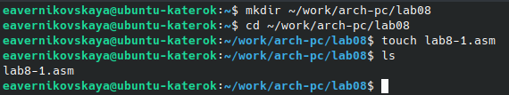{#fig:001 width=70%}

Копируем из каталога «~/work/arch-pc/lab07» файл «in_out.asm» (рис. [-@fig:002])

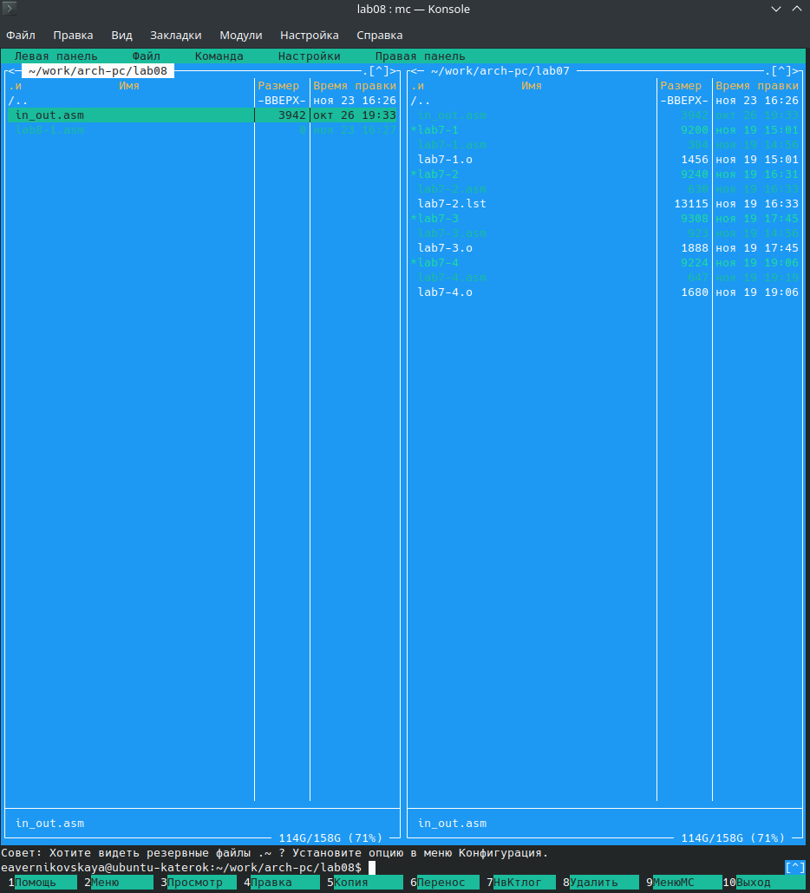{#fig:002 width=70%}

Вводим нужный текст программы с использованием инструкции loop (рис. [-@fig:003])

Текст программы:

```NASM
%include 'in_out.asm'
SECTION .data
msg1 db 'Введите N: ',0h
SECTION .bss
N: resb 10
SECTION .text
global _start
_start:
	mov eax,msg1
	call sprint
	mov ecx,N
	mov edx,10
	call sread
	mov eax,N
	call atoi
	mov [N],eax
	mov ecx,[N]
	label:
		mov [N],ecx
		mov eax,[N]
		call iprintLF
		loop label
		call quit
```

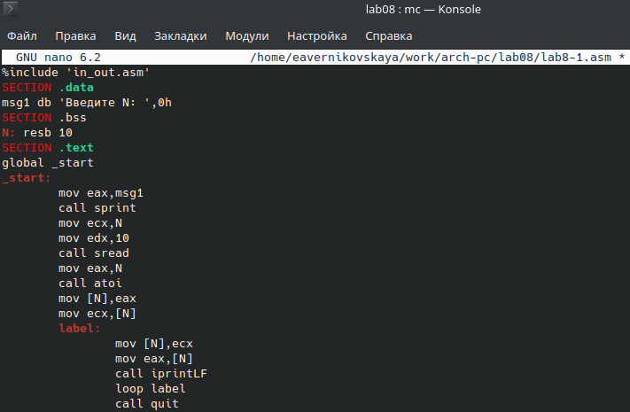{#fig:003 width=70%}

Создаём исполняемый файл и запускаем его (рис. [-@fig:004])

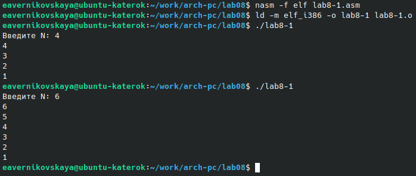{#fig:004 width=70%}

Изменяем текст программы, добавив изменение значение регистра ecx в цикле label (рис. [-@fig:005])

Изменённый текст программы:

```NASM
%include 'in_out.asm'
SECTION .data
msg1 db 'Введите N: ',0h
SECTION .bss
N: resb 10
SECTION .text
global _start
_start:
	mov eax,msg1
	call sprint
	mov ecx,N
	mov edx,10
	call sread
	mov eax,N
	call atoi
	mov [N],eax
	mov ecx,[N]
	label:
		sub ecx,1
		mov [N],ecx
		mov eax,[N]
		call iprintLF
		loop label
		call quit
```

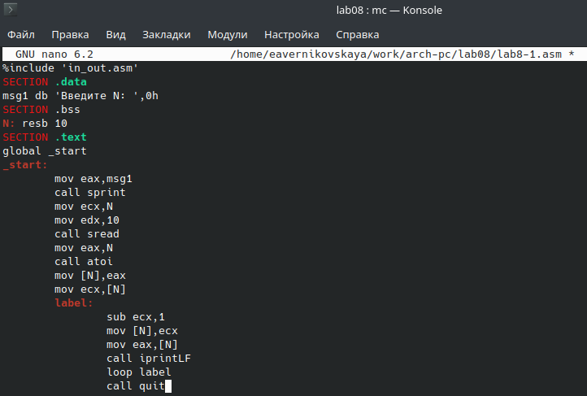{#fig:005 width=70%}

Снова создаём исполняемый файл и запускаем его (рис. [-@fig:006]), (рис. [-@fig:007]) и (рис. [-@fig:008])

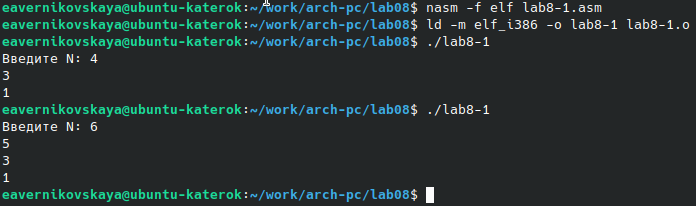{#fig:006 width=70%}

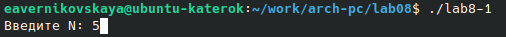{#fig:007 width=70%}

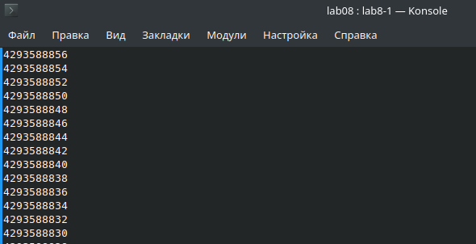{#fig:008 width=70%}

Ответы на вопросы:

1) Какие значения принимает регистр ecx в цикле?

- Регистр ecx принимает некорректные значения в цикле.

2) Соответствует ли число проходов цикла значению N введённому с клавиатуры?

- Нет. Число проходов не соответствует значению N введённому с клавиатуры.

Снова изменяем текст программы так, добавив команды push и pop (рис. [-@fig:009])

Изменённый текст программы: 

```NASM
%include 'in_out.asm'
SECTION .data
msg1 db 'Введите N: ',0h
SECTION .bss
N: resb 10
SECTION .text
global _start
_start:
	mov eax,msg1
	call sprint
	mov ecx,N
	mov edx,10
	call sread
	mov eax,N
	call atoi
	mov [N],eax
	mov ecx,[N]
	label:
		push ecx
		sub ecx,1
		mov [N],ecx
		mov eax,[N]
		call iprintLF
		pop ecx
		loop label
		call quit
```

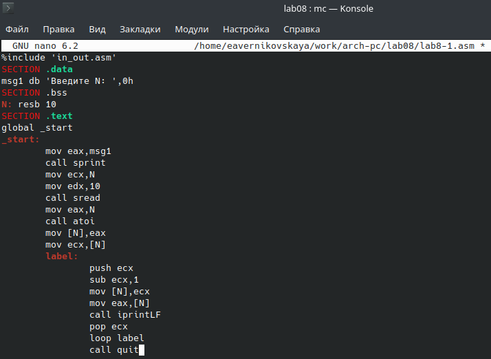{#fig:009 width=70%}

Опять создаём исполняемый файл и запускаем его (рис. [-@fig:010])

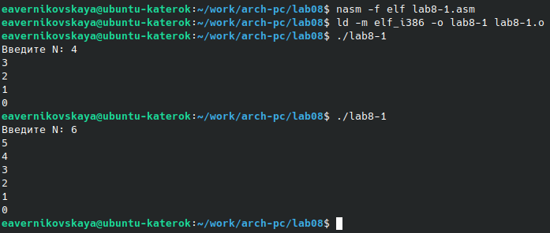{#fig:010 width=70%}

Ответы на вопросы:

1) Соответствует ли в данном случае число проходов цикла значению N введённому с клавиатуры?

- Да, теперь соответствует.

## Обработка аргументов командной строки

Создаём файл «lab8-2.asm» (рис. [-@fig:011])

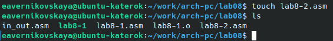{#fig:011 width=70%}

Вводим текст программы, которая выводит на экран аргументы командной строки (рис. [-@fig:012])

Текст программы:

```NASM
%include 'in_out.asm'
SECTION .text
global _start
_start:
	pop ecx
	pop edx
	sub ecx,1
	next:
		cmp ecx,0
		jz _end
		pop eax
		call sprintLF
		loop next
	_end:
		call quit
```

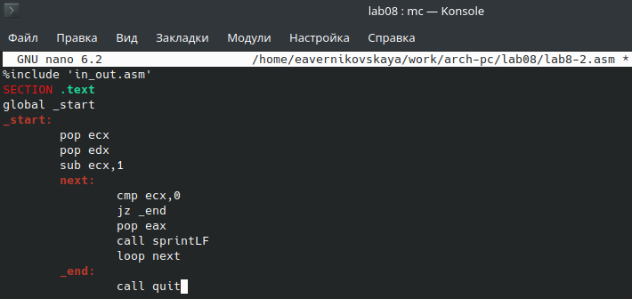{#fig:012 width=70%}

Создаём исполняемый файл и запускаем его, указав аргументы (рис. [-@fig:013])

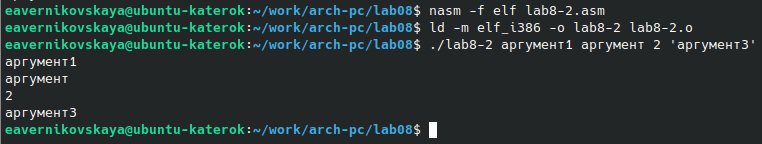{#fig:013 width=70%}

Ответы на вопросы:

1) Сколько аргументов было обработано программой?

- Программой было обработано 4 аргумента.

Создаём файл «lab8-3.asm» (рис. [-@fig:014])

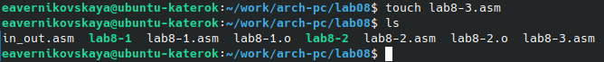{#fig:014 width=70%}

Вводим текст программы, которая вычисляет сумму аргументов командной строки (рис. [-@fig:015])

Текст программы:

```NASM
%include 'in_out.asm'
SECTION .data
msg db 'Результат: ',0
SECTION .text
global _start
_start:
	pop ecx
	pop edx
	sub ecx,1
	mov esi,0
	next:
		cmp ecx,0h
		jz _end
		pop eax
		call atoi
		add esi,eax
		loop next
	_end:
		mov eax,msg
		call sprint
		mov eax,esi
		call iprintLF
		call quit
```

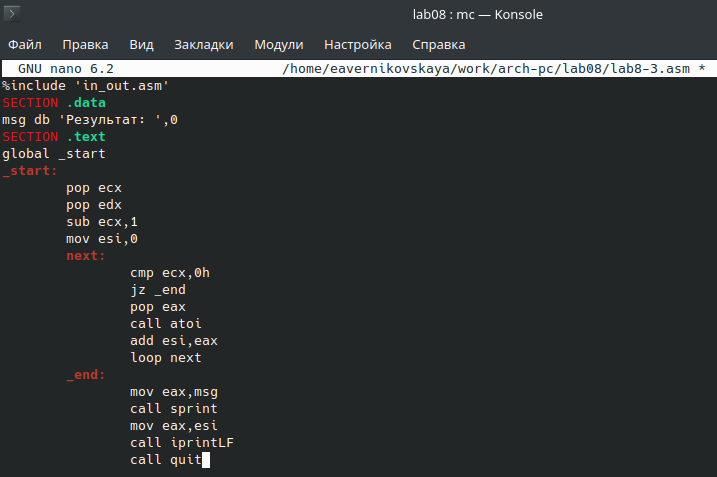{#fig:015 width=70%}

Создаём исполняемый файл и запускаем его, указав аргументы (рис. [-@fig:016])

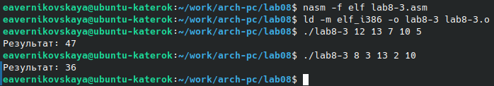{#fig:016 width=70%}

Изменяем текст программы так, чтобы она вычисляла произведение аргументов командной строки (рис. [-@fig:017])

Изменённый текст программы:

```NASM
%include 'in_out.asm'
SECTION .data
msg db 'Результат: ',0
SECTION .text
global _start
_start:
	pop ecx
	pop edx
	sub ecx,1
	mov esi,1
	next:
		cmp ecx,0h
		jz _end
		pop eax
		call atoi
		imul esi,eax
		loop next
	_end:
		mov eax,msg
		call sprint
		mov eax,esi
		call iprintLF
		call quit
```

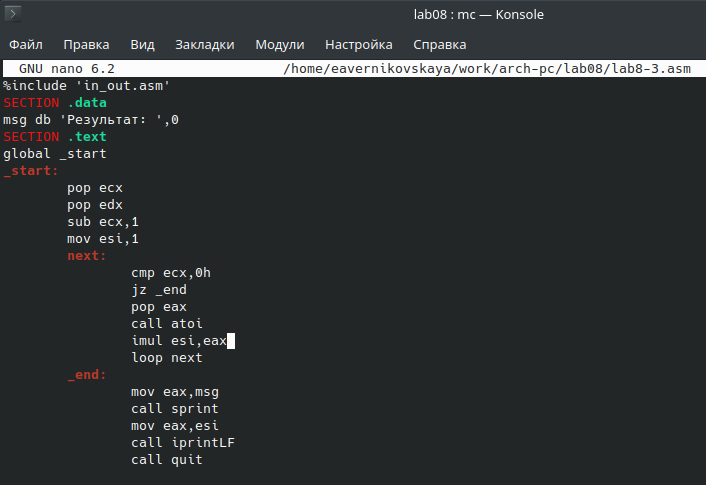{#fig:017 width=70%}

Создаём исполняемый файл и запускаем его, указав аргументы (рис. [-@fig:018])

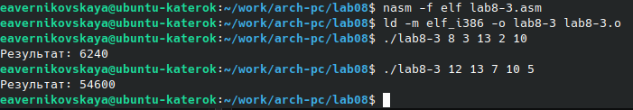{#fig:018 width=70%}

## Задание для самостоятельной работы

Создаём файл «lab8-4.asm» (рис. [-@fig:019])

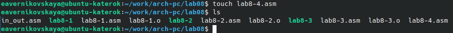{#fig:019 width=70%}

Вводим текст программы. Программа находит сумму значений функции f(x)=10(x-1) для разных x. Программа выводит значение f(x1) + f(x2) + ... + f(xn) (рис. [-@fig:020])

Текст программы:

```NASM
%include 'in_out.asm'
SECTION .data
msg1: DB 'Функция: f(x)=10(x-1)',0
msg2 db 'Результат: ',0
SECTION .bss
fx: RESB 80
SECTION .text
global _start
_start:
	mov eax,msg1
	call sprintLF
	pop ecx
	pop edx
	sub ecx,1
	mov esi,10
	next:
		cmp ecx,0h
		jz _end
		pop eax
		call atoi
		sub eax,1
		mul esi
		add [fx],eax
		loop next
	_end:
		mov eax,msg2
		call sprint
		mov eax,[fx]
		call iprintLF
		call quit
```

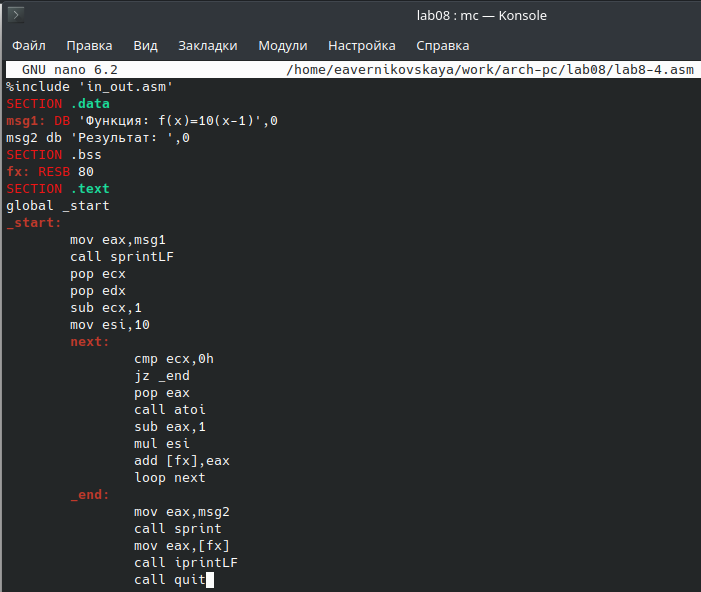{#fig:020 width=70%}

Создаём исполняемый файл и запускаем его, указав аргументы - разные значения x (рис. [-@fig:021])

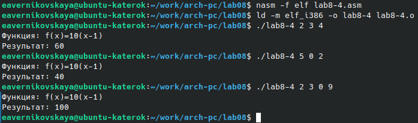{#fig:021 width=70%}

# Выводы

В ходе выполнения лабораторной работы мы приобрели навыки написания программ с использованием циклов и обработкой аргументов командной строки.
