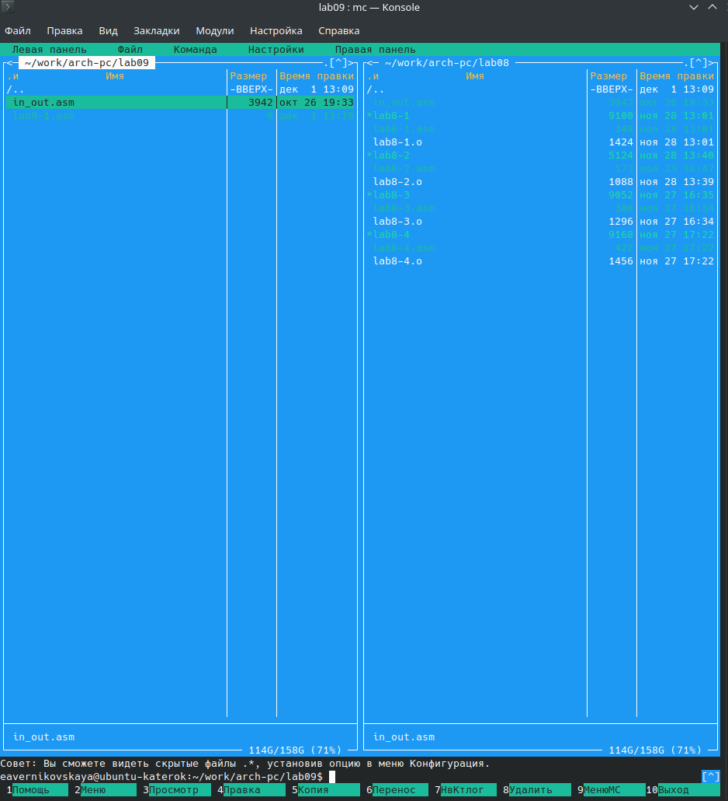
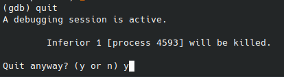
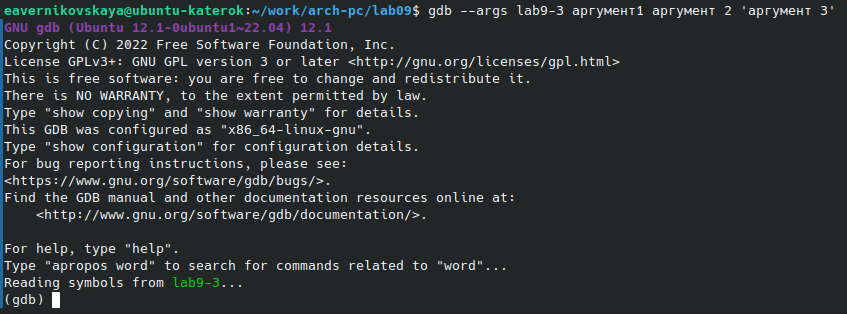

---
## Front matter
title: "Отчёт по лабораторной работе №9"
subtitle: "Дисциплина: Архитектура компьютера"
author: "Студент: Верниковская Екатерина Андреевна"

## Generic otions
lang: ru-RU
toc-title: "Содержание"

## Bibliography
bibliography: bib/cite.bib
csl: pandoc/csl/gost-r-7-0-5-2008-numeric.csl

## Pdf output format
toc: true # Table of contents
toc-depth: 2
lof: true # List of figures
lot: true # List of tables
fontsize: 12pt
linestretch: 1.5
papersize: a4
documentclass: scrreprt
## I18n polyglossia
polyglossia-lang:
  name: russian
  options:
	- spelling=modern
	- babelshorthands=true
polyglossia-otherlangs:
  name: english
## I18n babel
babel-lang: russian
babel-otherlangs: english
## Fonts
mainfont: PT Serif
romanfont: PT Serif
sansfont: PT Sans
monofont: PT Mono
mainfontoptions: Ligatures=TeX
romanfontoptions: Ligatures=TeX
sansfontoptions: Ligatures=TeX,Scale=MatchLowercase
monofontoptions: Scale=MatchLowercase,Scale=0.9
## Biblatex
biblatex: true
biblio-style: "gost-numeric"
biblatexoptions:
  - parentracker=true
  - backend=biber
  - hyperref=auto
  - language=auto
  - autolang=other*
  - citestyle=gost-numeric
## Pandoc-crossref LaTeX customization
figureTitle: "Рис."
tableTitle: "Таблица"
listingTitle: "Листинг"
lofTitle: "Список иллюстраций"
lotTitle: "Список таблиц"
lolTitle: "Листинги"
## Misc options
indent: true
header-includes:
  - \usepackage{indentfirst}
  - \usepackage{float} # keep figures where there are in the text
  - \floatplacement{figure}{H} # keep figures where there are in the text
---

# Цель работы

Приобрести навыки написания программ с использованием подпрограмм. Познакомиться с методами отладки при помощи GDB и его основными возможностями.

# Задание

1. Создать каталог для программ лабораторной работы №9 и в нём создать файл «lab9-1.asm».
2. Ввести в файл «lab9-1.asm» определённый текст программы с подпрограммой _calcul. Создать исполняемый файл и запустить его.
3. Изменить текст программы, добавив подпрограмму _subcalcul. Снова создать исполняемый файл и запустить его.
4. Опять изменить текст программы, добавив команды push и pop, создать исполняемый файл и запустить его.
5. Создать файл «lab9-2.asm» и ввести в него определённый текст программы (Программа печати сообщения Hello world!). 
6. Создать исполняемый файл с отладочной информацией.
7. Сделать задания, которые помогут лучше понять структуру GDB.
8. Преобразовать программу из лабораторной работы №8 (задание №1 для самостоятельной работы), реализовав вычисление значения функции f(x) как подпрограмму. 

Задание №1 для самостоятельной работы: Написать программу, которая находит сумму значений функции f(x) для x = x1, x2, ..., xn. Программа должна выводить значение f(x1) + f(x2) + ... + f(xn). Вид функции брать из определённой таблицы, в соответствии с полученным вариантом (В нашем случае это 17 вариант).

9. Создать файл и ввести в него программу, которая вычисляет выражение (3+2)*4+5. Спомощью отладчика GDB определить ошибку и исправить её. 

# Выполнение лабораторной работы

## Реализация подпрограмм в NASM

В созданном каталоге «~/work/arch-pc/lab09» создаём файл «lab9-1.asm» (рис. [-@fig:001])

{#fig:001 width=70%}

Копируем из каталога «~/work/arch-pc/lab08» файл «in_out.asm» (рис. [-@fig:002])

{#fig:002 width=70%}

Вводим нужный текст программы, которая вычисляет арифмитическое выражение f(x)=2x+7 с помощью подпрограммы _calcul (рис. [-@fig:003])

Текст программы:

```NASM
%include 'in_out.asm'
SECTION .data
msg: DB 'Введите x: ',0
result: DB '2x+7=',0
SECTION .bss
x: RESB 80
res: RESB 80
SECTION .text
GLOBAL _start
_start:
	mov eax,msg
	call sprint
	mov ecx,x
	mov edx,80
	call sread
	mov eax,x
	call atoi
	call _calcul
	mov eax,result
	call sprint
	mov eax,[res]
	call iprintLF
	call quit
	_calcul:
		mov ebx,2
		mul ebx
		add eax,7
		mov [res],eax
		ret
```

{#fig:003 width=70%}

Создаём исполняемый файл и запускаем его (рис. [-@fig:004])

{#fig:004 width=70%}

Изменяем текст программы, добавив подпрограмму _subcalcul в подпрограмму _calcul, для вычисления выражения f(g(x)). f(x)=2x+7 а g(x)=3x-1 (рис. [-@fig:005])

Изменённый текст программы:

```NASM
%include 'in_out.asm'
SECTION .data
msg1: DB 'f(x)=2x+7; g(x)=3x-1',0
msg: DB 'Введите x: ',0
result: DB 'f(g(x))=',0
SECTION .bss
x: RESB 80
res: RESB 80
SECTION .text
GLOBAL _start
_start:
	mov eax,msg1
	call sprintLF
	mov eax,msg
	call sprint
	mov ecx,x
	mov edx,80
	call sread
	mov eax,x
	call atoi
	call _calcul
	mov eax,result
	call sprint
	mov eax,[res]
	call iprintLF
	call quit
	_calcul:
		push eax
		call _subcalcul
		pop ecx
		mov ebx,2
		mul ebx
		add eax,7
		mov [res],eax
		ret
	_subcalcul:
		mov ebx,3
		mul ebx
		sub eax,1
		ret
```

{#fig:005 width=70%}

Снова создаём исполняемый файл и запускаем его (рис. [-@fig:006])

{#fig:006 width=70%}

## Отладка программ с помощью GDB

Создаём файл «lab9-2.asm» (рис. [-@fig:007])

{#fig:007 width=70%}

Вводим текст программы - программа печати сообщения Hello world! (рис. [-@fig:008])

Текст программы:

```NASM
SECTION .data
msg1: db "Hello, ",0x0
msg1Len: equ $ - msg1
msg2: db "world!",0xa
msg2Len: equ $ - msg2
SECTION .text
global _start
_start:
	mov eax,4
	mov ebx,1
	mov ecx,msg1
	mov edx,msg1Len
	int 0x80
	mov eax,4
	mov ebx,1
	mov ecx,msg2
	mov edx,msg2Len
	int 0x80
	mov eax,1
	mov ebx,0
	int 0x80
```

{#fig:008 width=70%}

Создаём исполняемый файл. Для работы с GDB в исполняемый файл необходимо добавить отладочную информацию. Для этого трансляцию программ мы проводим с ключом ‘-g’ (рис. [-@fig:009])

{#fig:009 width=70%}

Загружаем исполняемый файл в отладчик gdb (рис. [-@fig:010])

{#fig:010 width=70%}

Проверяем работу программы, запустив её в оболочке GDB с помощью команды ‘run’ (рис. [-@fig:011])

{#fig:011 width=70%}

Для более подробного анализа программы устанавливаем брейкпоинт на метку «_start», с которой начинается выполнение любой ассемблерной программы, и запускаем её (рис. [-@fig:012])

{#fig:012 width=70%}

Смотрим дисассимилированный код программы с помощью команды ‘disassemble’ начиная с метки «_start»  (рис. [-@fig:013])

{#fig:013 width=70%}

Переключаемся на отображение команд с Intel’овским синтаксисом, введя команду ’set disassembly-flavor intel’ (рис. [-@fig:014])

{#fig:014 width=70%}

Различия отображения синтаксиса машинных команд в режимах ATT и Intel:

1. **Порядок операндов:**
	- В ATT синтаксисе порядок операндов обратный, сначала указывается исходный операнд, а затем - 			результирующий операнд.
	- В Intel синтаксисе порядок обычно прямой, результирующий операнд указывается первым, а исходный - вторым.
	
2. **Разделители:**
	- В ATT синтаксисе разделители операндов - запятые.
	- В Intel синтаксисе разделители могут быть запятые или косые черты (/).
	
3. **Префиксы размера операндов:**
	- В ATT синтаксисе размер операнда указывается перед операндом с использованием префиксов, таких как “b” (byte), “w” (word), “l” (long) и “q” (quadword).
	- В Intel синтаксисе размер операнда указывается после операнда с использованием суффиксов, таких как “b”, “w”, “d” и “q”.
	
4. **Знак операндов:**
	- В ATT синтаксисе операнды с позитивными значениями предваряются символом “$".
	- В Intel синтаксисе операнды с позитивными значениями могут быть указаны без символа "$”.
	
5. **Обозначение адресов:**
	- В ATT синтаксисе адреса указываются в круглых скобках.
	- В Intel синтаксисе адреса указываются без скобок.
	
6. **Обозначение регистров:**
	- В ATT синтаксисе обозначение регистра начинается с символа “%”.
	- В Intel синтаксисе обозначение регистра может начинаться с символа “R” или “E” (например, “%eax” или “RAX”).

Включаем режим псевдографики для более удобного анализа программы (рис. [-@fig:015]), (рис. [-@fig:016]

{#fig:015 width=70%}

{#fig:016 width=70%}

### Добавление точек останова

Проверяем с помощью команды ‘info breakpoints’ была ли установлена точка останова по имени на предыдущих шагах «_start» (рис. [-@fig:017])

{#fig:017 width=70%}

Определяем адрес предпоследней инструкции (mov ebx,0x0) и устнавливаеи точку останова (рис. [-@fig:018])

{#fig:018 width=70%}

Смотрим информацию о всех установленных точках останова (рис. [-@fig:019])

{#fig:019 width=70%}

### Работа с данными программы в GDB

Выполняем 5 инструкций с помощью команды ‘stepi’ (рис. [-@fig:020]), (рис. [-@fig:021]), (рис. [-@fig:022]), (рис. [-@fig:023]), (рис. [-@fig:024])

{#fig:020 width=70%}

{#fig:021 width=70%}

{#fig:022 width=70%}

{#fig:023 width=70%}

{#fig:024 width=70%}

Вопрос: значения каких регистров изменяются?

Ответ: во время выполнения команд менялись регистры ebx, ecx, edx, eip и eax.

Смотрим содержимое регистрв с помощью команды info registers’ (рис. [-@fig:025])

{#fig:025 width=70%}

Смотрим значение переменной msg1 по имени (рис. [-@fig:026])

{#fig:026 width=70%}

Смотрим значение переменной msg2 по адресу (рис. [-@fig:027])

{#fig:027 width=70%}

Смотрим инструкцию «mov ecx,msg2», которая записывает в регистр ecx адрес переменной msg2 (рис. [-@fig:028])

{#fig:028 width=70%}

Изменяем первый символ переменной msg1 с помощью команды ‘set’ (большую букву меняем на маленькую) (рис. [-@fig:029])

{#fig:029 width=70%}

Заменям первый символ во второй переменной msg2 (маленькую букву меняем на большую) (рис. [-@fig:030])

{#fig:030 width=70%}

Смотрим значение регистра edx в различных форматах (сначала в двоичном, потом шестнадцатеричном, а затем в символьном) (рис. [-@fig:031])

{#fig:031 width=70%}

С помощью комнады ‘set’ изменяем значение регистра ebx (рис. [-@fig:032]), (рис. [-@fig:033])

{#fig:032 width=70%}

{#fig:033 width=70%}

Вопрос: в чём разница вывода команд ‘p/s $ebx‘?

Ответ: Выводятся разные значения, так как команда без кавычек присваивает регистру вводимое значение.

Завершаем выполнение программы с помощью команды ‘continue‘ (рис. [-@fig:034])

{#fig:034 width=70%}

Выходим из GDB с помощью команды ‘quit‘ (рис. [-@fig:035]), (рис. [-@fig:036])

{#fig:035 width=70%}

{#fig:036 width=70%}

### Обработка аргументов командной строки в GDB

Копируем файл «lab8-2.asm», созданный при выполнении лабораторной работы №8, с программой выводящей на экран аргументы командной строки в файл с именем «lab9-3.asm» (рис. [-@fig:037])

{#fig:037 width=70%}

Создаём исполняемый файл (рис. [-@fig:038])

{#fig:038 width=70%}

Загружаем программу с аргументами в GDB. Для этого используем ключ ‘--args‘ (рис. [-@fig:039])

{#fig:039 width=70%}

Устанавливаем точку останова перед первой инструкцией в программе и запускаем её (рис. [-@fig:040])

{#fig:040 width=70%}

Изучаем адрес вершины стека (рис. [-@fig:041])

{#fig:041 width=70%}

Смотрим остальные позиции стека (рис. [-@fig:042])

{#fig:042 width=70%}

Вопрос: почему шаг изменения адреса равен 4?

Ответ: шаг изменения адреса равен 4, потому что адресные регистры увеличиваются на 4 при выполнении инструкций в режиме 32-битных (4 байта) процессоров x86. Поэтому при выполнении каждой инструкции адрес следующей инструкции увеличивается на 4. А, например, в случае использованмия режима 64-битных (8 байтаов) процессоров x86 адреса будут увеличиваться на 8.

## Задание для самостоятельной работы

Создаём файл «lab9-4.asm» (рис. [-@fig:043])

{#fig:043 width=70%}

Переписываем программу из лабораторной работы №8, реализовав вычисления функции f(x) как подпрограмму (рис. [-@fig:044])

Текст изменённой программы:

```NASM
%include 'in_out.asm'
SECTION .data
msg1: DB 'Функция: f(x)=10(x-1)',0
msg2 db 'Результат: ',0
SECTION .bss
fx: RESB 80
SECTION .text
global _start
_start:
	mov eax,msg1
	call sprintLF
	pop ecx
	pop edx
	sub ecx,1
	mov esi,10
	next:
		cmp ecx,0h
		jz _end
		pop eax
		call atoi
		call _calcul_f
		add [fx],eax
		loop next
	_end:
		mov eax,msg2
		call sprint
		mov eax,[fx]
		call iprintLF
		call quit
	_calcul_f:
		sub eax,1
		mul esi
		ret
```

{#fig:044 width=70%}

Создаём исполняемый файл и запускаем его (рис. [-@fig:045])

{#fig:045 width=70%}

Создаём файл «lab9-5.asm» (рис. [-@fig:046])

{#fig:046 width=70%}

Вводим текст программы, которая вычисляет выражение (3+2)*4+5 (рис. [-@fig:047])

Текст программы:

```NASM
%include 'in_out.asm'
SECTION .data
div: DB 'Результат: ',0
SECTION .text
GLOBAL _start
_start:
	mov ebx,3
	mov eax,2
	add ebx,eax
	mov ecx,4
	mul ecx
	add ebx,5
	mov edi,ebx
	mov eax,div
	call sprint
	mov eax,edi
	call iprintLF
	call quit
```

{#fig:047 width=70%}

Создаём исполняемый файл (рис. [-@fig:048])

{#fig:048 width=70%}

Загружаем исполняемый файл в отладчик gdb (рис. [-@fig:049])

{#fig:049 width=70%}

Проверяем работу программы, запустив её в оболочке GDB с помощью команды ‘run’ (рис. [-@fig:050])

{#fig:050 width=70%}

При запуске программа даёт неверный результат.

Запускаем исполняемый файл в отладчике GDB и смотрим на изменения регистров с помощью команды ‘stepi’ (рис. [-@fig:051])

{#fig:051 width=70%}

Обнаружив ошибку, исправляем программу (рис. [-@fig:052])

Текст исправленной программы:

```NASM
%include 'in_out.asm'
SECTION .data
div: DB 'Результат: ',0
SECTION .text
GLOBAL _start
_start:
	mov ebx,3
	mov eax,2
	add eax,ebx
	mov ecx,4
	mul ecx
	add eax,5
	mov edi,eax
	mov eax,div
	call sprint
	mov eax,edi
	call iprintLF
	call quit
```

{#fig:052 width=70%}

Проверяем работу исправленной программы (рис. [-@fig:053])

{#fig:053 width=70%}

# Выводы

В ходе выполнения лабораторной работы мы приобрели навыки написания программ с использованием подпрограмм. Также мы познакомились с методами отладки при помощи GDB и его основными возможностями.
