---
## Front matter
title: "Отчёт по лабораторной работе №10"
subtitle: "Дисциплина: Архитектура компьютера"
author: "Студент: Верниковская Екатерина Андреевна"

## Generic otions
lang: ru-RU
toc-title: "Содержание"

## Bibliography
bibliography: bib/cite.bib
csl: pandoc/csl/gost-r-7-0-5-2008-numeric.csl

## Pdf output format
toc: true # Table of contents
toc-depth: 2
lof: true # List of figures
lot: true # List of tables
fontsize: 12pt
linestretch: 1.5
papersize: a4
documentclass: scrreprt
## I18n polyglossia
polyglossia-lang:
  name: russian
  options:
	- spelling=modern
	- babelshorthands=true
polyglossia-otherlangs:
  name: english
## I18n babel
babel-lang: russian
babel-otherlangs: english
## Fonts
mainfont: PT Serif
romanfont: PT Serif
sansfont: PT Sans
monofont: PT Mono
mainfontoptions: Ligatures=TeX
romanfontoptions: Ligatures=TeX
sansfontoptions: Ligatures=TeX,Scale=MatchLowercase
monofontoptions: Scale=MatchLowercase,Scale=0.9
## Biblatex
biblatex: true
biblio-style: "gost-numeric"
biblatexoptions:
  - parentracker=true
  - backend=biber
  - hyperref=auto
  - language=auto
  - autolang=other*
  - citestyle=gost-numeric
## Pandoc-crossref LaTeX customization
figureTitle: "Рис."
tableTitle: "Таблица"
listingTitle: "Листинг"
lofTitle: "Список иллюстраций"
lotTitle: "Список таблиц"
lolTitle: "Листинги"
## Misc options
indent: true
header-includes:
  - \usepackage{indentfirst}
  - \usepackage{float} # keep figures where there are in the text
  - \floatplacement{figure}{H} # keep figures where there are in the text
---

# Цель работы

Приобрести навыки написания программ для работы с файлами.

# Задание

1. Создать каталог для программ лабораторной работы №10 и в нём создать файлы «lab10-1.asm», «readme-1.txt» и «readme-2.txt».
2. Ввести в файл «lab10-1.asm» текст программы, которая записывает в файл сообщение. Создать исполняемый файл и проверить его работу.
3. С помощью команды ‘chmod’ изменить права доступа к исполняемому файлу «lab10-1» (запретить его выполнение), а затем изменить права доступа к файлу «lab10-1.asm» (добавить права на исполнение).
4. Объяснить результаты.
5. В соответствии с вариантом из таблицы 10.4 (у меня 17 вариант) предоставить правва доступа к файлу «readme-1.txt» (в символьном виде) и к файлу «readme-2.txt» (в двоичном виде). 
6. Проверить правильность выполнения.
7. Создать файл «lab10-2.asm». 
8. Написать программу, которая работает по определённому алгоритму.
9. Создать исполняемый файл и проверить его работу. Проверить наличие файла и его содержимое.

# Выполнение лабораторной работы

В созданном каталоге «~/work/arch-pc/lab10» создаём файлы «lab10-1.asm», «readme-1.txt» и «readme-2.txt». (рис. [-@fig:001])

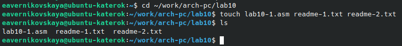{#fig:001 width=70%}

Копируем из каталога «~/work/arch-pc/lab09» файл «in_out.asm» (рис. [-@fig:002])

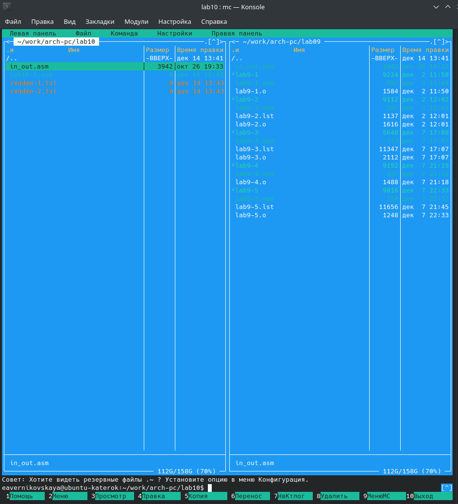{#fig:002 width=70%}

В файл «lab10-1.asm» вводим текст программы, которая записывает в уже существующий файл сообщение (рис. [-@fig:003])

Текст программы:

```NASM
%include 'in_out.asm'
SECTION .data
filename db 'readme.txt',0h
msg db 'Введите строку для записи в файл: ',0h
SECTION .bss
contents resb 255
SECTION .text
global _start
_start:
	mov eax,msg
	call sprint
	mov ecx,contents
	mov edx,255
	call sread
	mov ecx,2
	mov ebx,filename
	mov eax,5
	int 80h
	mov esi,eax
	mov eax,contents
	call slen
	mov edx,eax
	mov ecx,contents
	mov ebx,esi
	mov eax,4
	int 80h
	mov ebx,esi
	mov eax,6
	int 80h
	call quit
```

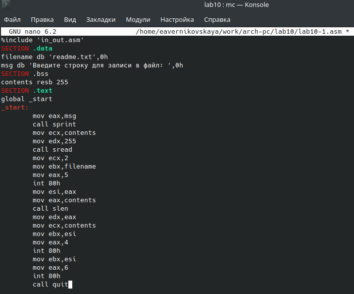{#fig:003 width=70%}

Создаём файл «readme.txt», для того чтобы программа записала в этот файл введённую строку (т.к. программа записывает сообщение в существующий файл) (рис. [-@fig:004])

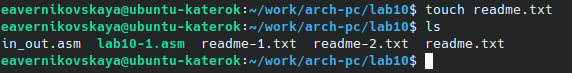{#fig:004 width=70%}

Создаём исполняемый файл и запускаем его (рис. [-@fig:005])

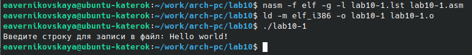{#fig:005 width=70%}

Проверяем наличие файла с помощью команды ‘ls -l’ (с помощью неё можно узнать права доступа к файлу). Также проверяем содержимое файла с помощью ‘cat’ (рис. [-@fig:006])

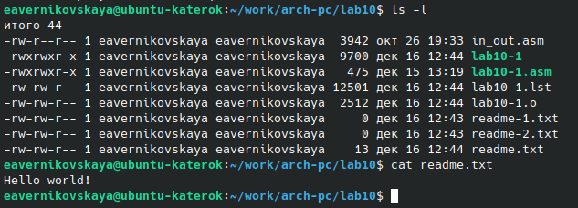{#fig:006 width=70%}

С помощью команды ‘chmod’ изменяем права доступа к файлу «lab10-1», запретив его выполнение. Далее пытаемся выполнить файл. (рис. [-@fig:007])

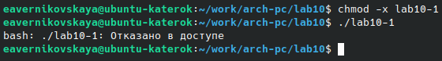{#fig:007 width=70%}

Объяснение результата: команда ‘./lab10-1’ выдала ОТКАЗАНО В ДОСТУПЕ. Это значит, что мы правильно поставили запрет на выполнение. 

С помощью команды ‘chmod’ изменяем права доступа к файлу «lab10-1.asm» с исходным текстом программы, добавив права на исполнение. Далее пытаемся выполнить файл. (рис. [-@fig:008])

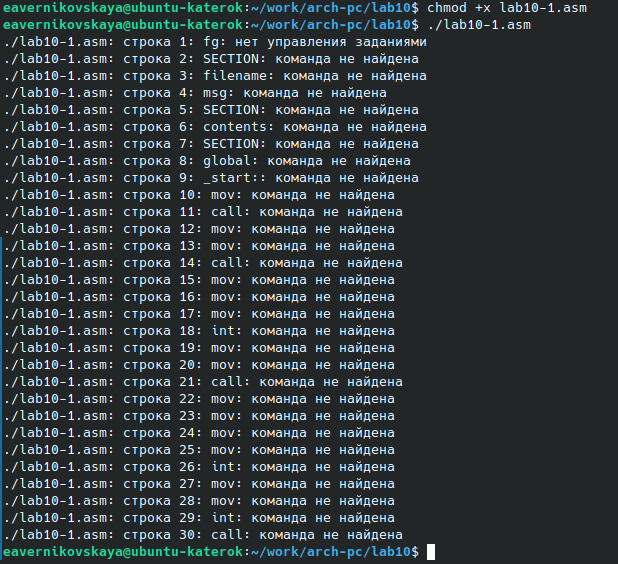{#fig:008 width=70%}

Объяснение результата: файл «lab10-1.asm» является файлом с исходным кодом программы на языке ассемблере. Добавление права на исполнение не даст ожидаемого результата. Такие файлы (.asm) нужно компилировать или ассемблировать в машинный код, а затем выполнять.

В соответствии с вариантом в таблице 10.4 (у меня 17 вариант) предоставляем права доступа к файлу «readme-1.txt», представленные в символьном виде (r-x -wx rw-). Затем проверяем правильность с помощью команды ‘ls -l’ (рис. [-@fig:009])

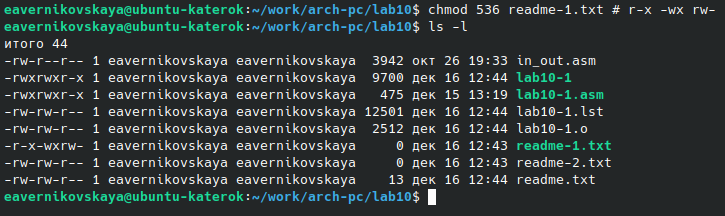{#fig:009 width=70%}

(r-x -wx rw-) это значит что владельцу разрешено чтение и исполнение, группе запись и исполнение, а остальным чтение и запись.

Предоставляем права доступа к файлу «readme-2.txt», представленные уже в двоичном виде (010 000 010). Затем проверяем правильность с помощью команды ‘ls -l’ (рис. [-@fig:010])

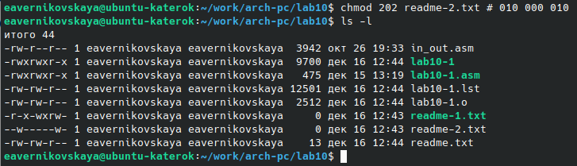{#fig:010 width=70%}

(000 010 000) это значит что владельцу ничего не разрешено, группе только чтение, а остальным тоже ничего.

Смотрим на файл «readme-2.txt» и видим что права ограничены (рис. [-@fig:011]), (рис. [-@fig:012])

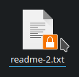{#fig:011 width=70%}

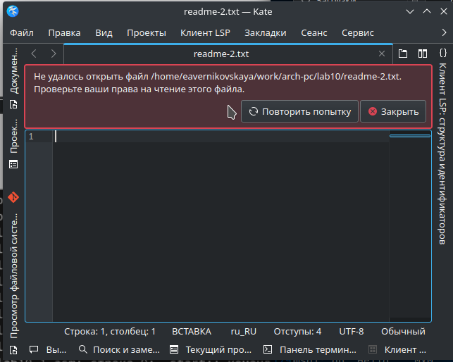{#fig:012 width=70%}

## Задание для самостоятельной работы

Создаём файл «lab10-2.asm» (рис. [-@fig:013])

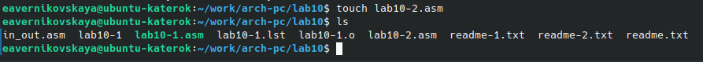{#fig:013 width=70%}

Пишем программу, которая работает по следующему алгоритму:

- Вывод приглашения "Как вас зовут?"
- ввести с клавиатуры свои фамилию и имя
- создать файл с именем «name.txt»
- записать в файл сообщение "Меня зовут"
- дописать в файл строку введённую с клавиатуры
- закрыть файл (рис. [-@fig:014])

Текст программы:

```NASM
%include 'in_out.asm'
SECTION .data
msg: DB 'Как вас зовут? ',0
filename: DB 'name.txt',0
name: DB 'Меня зовут ',0
SECTION .bss
N: RESB 80
SECTION .text
GLOBAL _start
_start:
	mov eax,msg
	call sprint
	mov ecx,N
	mov edx,80
	call sread
	mov ecx,0777o
	mov ebx,filename
	mov eax,8
	int 80h
	mov esi,eax
	mov eax,name
	call slen
	mov edx,eax
	mov ecx,name
	mov ebx,esi
	mov eax,4
	int 80h
	mov ebx,esi
	mov eax,6
	int 80h
	mov ecx,1
	mov ebx,filename
	mov eax,5
	int 80h
	mov esi,eax
	mov edx,2
	mov ecx,0
	mov ebx,eax
	mov eax,19
	int 80h
	mov eax,N
	call slen
	mov edx,eax
	mov ecx,N
	mov ebx,esi
	mov eax,4
	int 80h
	mov ebx,esi
	mov eax,6
	int 80h
	call quit
```

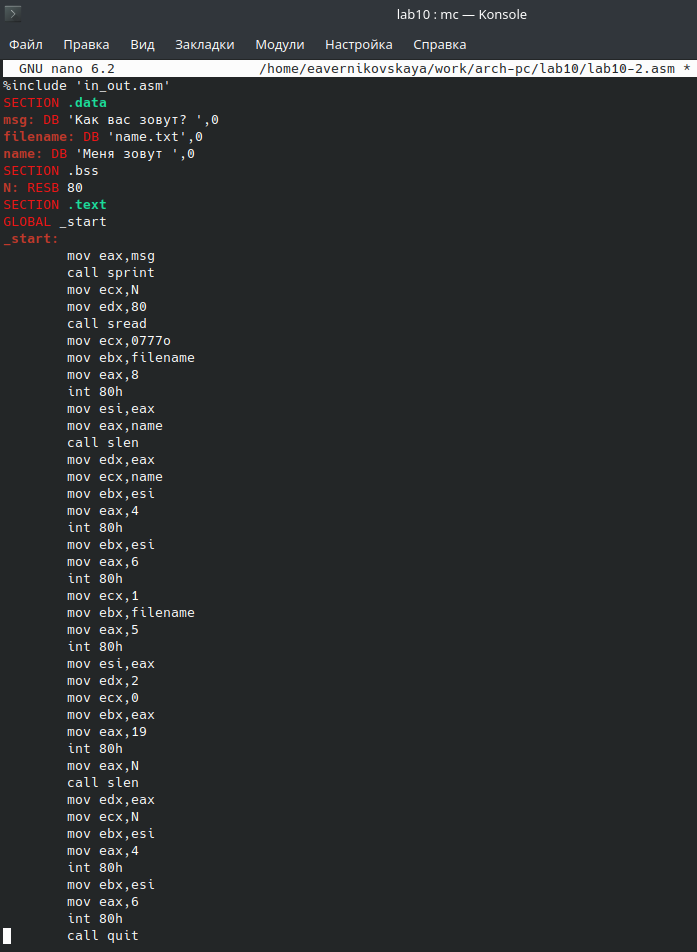{#fig:014 width=70%}

Создаём исполняемый файл и проверяем его работу (рис. [-@fig:015])

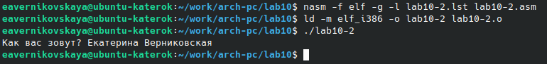{#fig:015 width=70%}

Проверяем наличие файла «name.txt» с помощью команды ‘ls -l’ (рис. [-@fig:016])

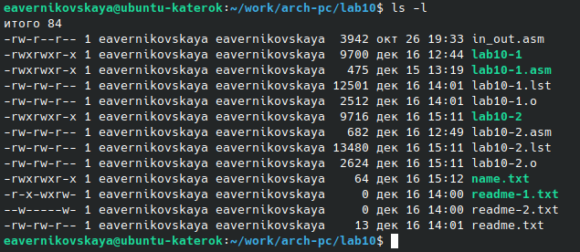{#fig:016 width=70%}

Проверяем содержимое файла «name.txt» с помощью команды ‘cat’ (рис. [-@fig:017])

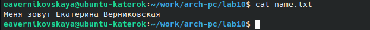{#fig:017 width=70%}

# Выводы

В ходе выполнения лабораторной работы мы приобрели навыки написания программ для работы с файлами.
